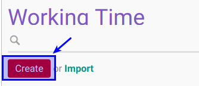
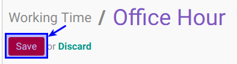

# Membuat Working Time

## A. INPUT

*(Tidak ada instruksi khusus)*

## B. LANGKAH KERJA

1. Buka menu **Human Resource -> Configuration -> Contract - Working Time**. Abaikan jika sudah berada pada menu yang dimaksud.
2. Klik tombol **Create** pada bagian atas-kiri form.

3. Isi **[Name](./penjelasan.md#field-name)**. Harus diisi.
4. Pilih **[Workgroup Manager](./penjelasan.md#field-manajer)**. Tidak Harus diisi.
5. Pilih **[Company](./penjelasan.md#field-company)**. Isian Default adalah nama perusahaan. Tidak Harus diisi.
6. Buka **Tab Working Time Schedule**
7. <a name="l7">[Tambahkan](./add-schedule.md)/[Modifikasi](./edit-schedule.md)/[Hapus](./del-schedule.md)</a>  **Working Time Schedule**.
8. Buka **Tab Rounding**
9. Isi **[Attendance Rounding](./penjelasan.md#field-rounding-attendance)**. Tidak Harus diisi.
10. Isi **[Leave Rounding](./penjelasan.md#field-rounding-leave)**. Tidak Harus diisi.
11. Isi **[Overtime Rounding](./penjelasan.md#field-rounding-overtime)**. Tidak Harus diisi.
12. Isi **[Overtime Rounding Tolerance](./penjelasan.md#field-rounding-tolerance)**. Tidak Harus diisi.
13. Buka **Tab Reason**
14. <a name="l14">[Tambahkan](./add-schedule-leave.md)/[Modifikasi](./edit-schedule-leave.md)/[Hapus](./del-schedule-leave.md)</a>  **Reason Leave**.
15. Jika akan **disimpan** Klik tombol **Save** pada bagian atas-kiri form.

## C. OUTPUT

*(Tidak ada instruksi khusus)*
