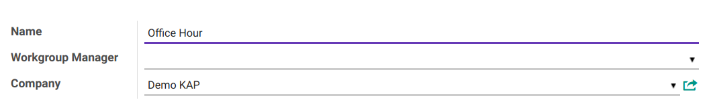
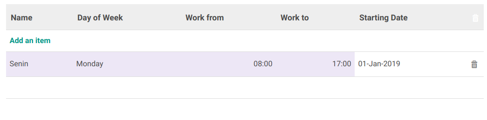
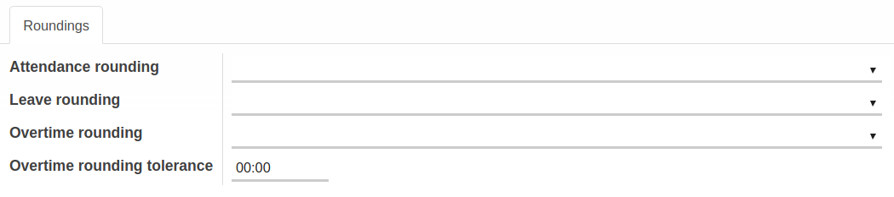
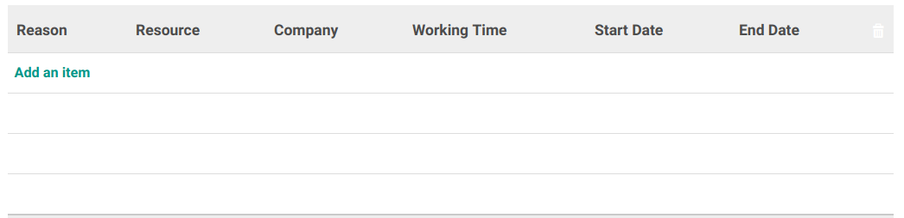

# Penjelasan Working Time

Informasi pada Working dibagi menjadi beberapa area, diantaranya:

* [Header](#bagian-header)
* [Tab Schedule Working Time](#tab-jadwal)
* [Tab Rounding](#tab-rounding)
* [Tab Reason](#tab-reason)

### <a name="bagian-header">HEADER</a>

#### <a name="field-name">-  Name</a>
  Nama Waktu Kerja

####  - <a name="field-manajer">Workgroup Manager</a>
  Mendefinisikan nama manajer

####  - <a name="field-company">Company</a>
  Mendefinisikan nama perusahaan

### <a name="tab-jadwal">WORKING TIME SCHEDULE</a>

####  - <a name="field-schedule-name">Name</a>
  Nama Jadwal

####  - <a name="field-schedule-dayofweek">Day Of Week</a>
  Mendefinisikan hari kerja

####  - <a name="field-schedule-workfrom">Work From</a>
  Mendefinisikan jam mulai kerja

####  - <a name="field-schedule-workto">Work To</a>
  Mendefinisikan jam akhir kerja

####  - <a name="field-schedule-startingdate">Starting Date</a>
  Mendefinisikan tanggal berlaku jadwal kerja

### <a name="tab-rounding">ROUNDING</a>

####  - <a name="field-rounding-attendance">Attendance Rounding</a>
  Mendefinisikan besaran pembulatan untuk kehadiran (dalam menit)

####  - <a name="field-rounding-Leave">Leave Rounding</a>
  Mendefinisikan besaran pembulatan untuk leave (dalam menit)

####  - <a name="field-rounding-overtime">Overtime Rounding</a>
  Mendefinisikan besaran pembulatan untuk overtime (dalam menit)

####  - <a name="field-rounding-tolerance">Overtime Rounding Tolerance</a>
  Mendefinisikan besaran pembulatan untuk nilai toleransi overtime (dalam jam)

### <a name="tab-reason">REASON</a>

####  - <a name="field-reason-resource">Resource</a>
  Mendefinisikan karyawan yang akan tidak  hadir

####  - <a name="field-reason-workingtime">Working Time</a>
  Mendefinisikan jam kerja / working time

####  - <a name="field-reason-reason">Reason</a>
  Mendefinisikan alasan tidak hadir

####  - <a name="field-reason-leaverequest">Leave Request</a>
  Mendefinisikan permintaan leave

####  - <a name="field-reason-duration">Duration</a>
  Mendefinisikan durasi ketidak hadiran : Mulai dan Berakhir (Dalam Tanggal dan Jam)
