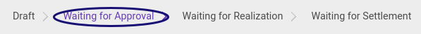
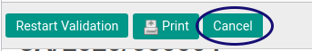
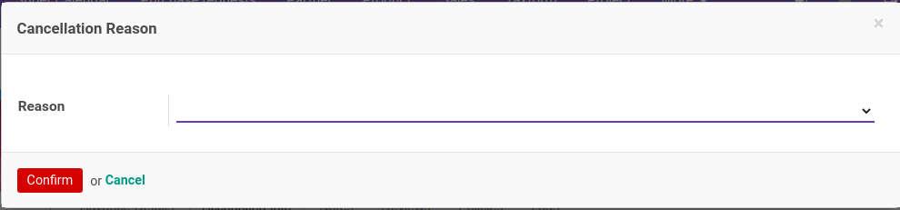
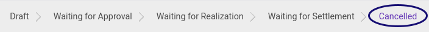

# Membatalkan Cash Advance

## A. INPUT

* Data *Cash Advance* yang akan dibatalkan harus memiliki status **Draft** atau **Waiting For Approval**.

* User yang akan membatalkan harus memiliki akses untuk **[Membatalkan Document](./penjelasan.md#field-can-cancel)** cash advance.

## B. INSTRUKSI KERJA

1. Buka menu **Human Resources -> Cash Advance -> Cash Advance**. Abaikan jika sudah berada pada menu yang dimaksud.
2. Buka data cash advance yang akan dibatalkan. Abaikan jika data sudah dibuka.
3. Klik tombol **Cancel** pada bagian atas-kiri form.

4. Pilih **[Reason](./penjelasan.md#field-cancel-reason)**. Harus disi.
5. Klik tombol **Confirm** pada bagian bawah kiri form.

6. Klik tombol **OK** pada bagian bawah kiri form.

## C. OUTPUT

* Data cash-advance akan berubah menjadi **Cancel**.

* Data **[Cancel](./penjelasan.md#field-log-cancel)** pada log cash advance akan berisi nama user dan tanggal saat pembatalan.

## Chapter
- [Transaksi](../../transaksi.md)
- [Penjelasan Cash Advance](./penjelasa.md)
- [Membuat Cash Advance](./membuat.md)
- [Modifikasi Cash Advance](./modifikasi.md)
- [Menghapus Cash Advance](./menghapus.md)
- [Menambah Detail Cash Advance](./membuat-detail.md)
- [Modifikasi Detail Cash Advance](./modifikasi-detail.md)
- [Menghapus Detail Cash Advance](./menghapus-detail.md)
- [Mengkonfirmasi Cash Advance](./mengkonfirmasi.md)
- [Menyetujui Cash Advance](./menyetujui.md)
- [Menolak Cash Advance](./menolak.md)
- [Merestart Persetujuan Cash Advance](./merestart-persetujuan.md)
- [Mengubah Nilai Cash Advance](./cash-advance/mengubah-nilai-cash-advance.md)
- [Merestart Cash Advance](./merestart.md)
- [Terminate Cash Advance](./terminate.md)
