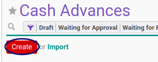

# Membuat Cash Advance

## A. INPUT

*(Tidak ada prasyarat khusus)*

## B. INSTRUKSI KERJA

1. Buka menu **Human Resources -> Cash Advance -> Cash Advance**. Abaikan jika sudah berada pada menu yang dimaksud.
2. Klik tombol **Create** pada bagian atas-kiri form.

3. Isi dan sesuaikan **[# Document](./penjelasan.md#field-document)** jika dibutuhkan. Harus diisi.
4. Pilih **[Employee](./penjelasan.md#field-employee)**. Harus diisi.
5. Pilih **[Department](./penjelasan.md#field-department)**. Tidak Harus diisi.
6. Pilih **[Manager](./penjelasan.md#field-manager)**. Tidak Harus diisi.
7. Pilih **[Job Position](./penjelasan.md#field-job-position)**. Tidak Harus diisi.
8. Isi **[Date Request](./penjelasan.md#field-date-request)**. Harus diisi.
9. Pilih **[Type](./penjelasan.md#field-type)**. Harus diisi.
10. Pilih **[Currency](./penjelasan.md#field-currency)**. Harus diisi.
11. Buka Tab **[Cash Advance Detail](./penjelasan.md#tab-detail)**.
12. <a name="l12">[Tambah](./membuat-detail.md)/[Modifikasi](./modifikasi-detail.md)/[Hapus](./menghapus-detail.md)</a> [**Cash Advance Detail**](./penjelasan.md#tab-detail). Lakukan sampai dengan anda selesai memasukkan semua **detail cash advance** yang dibutuhkan.
13. Buka Tab **[Accounting Info](./penjelasan.md#tab-accounting)**.
14. Pilih dan sesuaikan **[Journal](./penjelasan.md#field-journal)** jika dibutuhkan. Harus diisi.
15. Pilih dan sesuaikan **[Employee Advance Payable Account](./penjelasan.md#field-payable-account)** jika dibutuhkan. Harus diisi.
16. Pilih dan sesuaikan **[Employee Advance Account](./penjelasan.md#field-advance-account)** jika dibutuhkan. Harus diisi.
17. Buka Tab **[Note](./penjelasan.md#tab-note)**.
18. Isi **[Note](./penjelasan.md#field-tab-note-note)**. Tidak harus diisi.
19. Klik tombol **Save** pada bagian atas-kiri form.

## C. OUTPUT

* Data Cash Advance akan tersimpan dengan status **Draft**.

## Chapter
- [Transaksi](../../transaksi.md)
- [Penjelasan Cash Advance](./penjelasan.md)
- [Modifikasi Cash Advance](./modifikasi.md)
- [Menghapus Cash Advance](./menghapus.md)
- [Menambah Detail Cash Advance](./membuat-detail.md)
- [Modifikasi Detail Cash Advance](./modifikasi-detail.md)
- [Menghapus Detail Cash Advance](./menghapus-detail.md)
- [Mengkonfirmasi Cash Advance](./mengkonfirmasi.md)
- [Menyetujui Cash Advance](./menyetujui.md)
- [Menolak Cash Advance](./menolak.md)
- [Merestart Persetujuan Cash Advance](./merestart-persetujuan.md)
- [Mengubah Nilai Cash Advance](./cash-advance/mengubah-nilai-cash-advance.md)
- [Membatalkan Cash Advance](./membatalkan.md)
- [Merestart Cash Advance](./merestart.md)
- [Terminate Cash Advance](./terminate.md)
