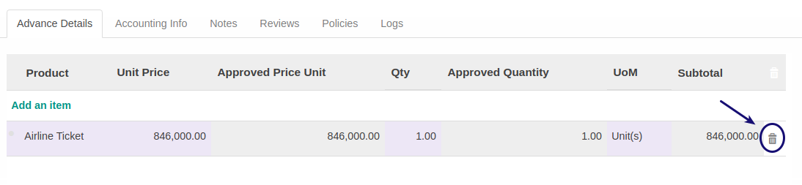

# Menghapus Detail Cash Advance

*(Instruksi kerja ini merupakan sub instruksi dari (1) [Membuat Cash Advance](./membuat.md), atau (2) [Memodifikasi Cash Advance](./modifikasi.md). Instruksi kerja ini tidak bisa berdiri sendiri)*

## A. INPUT

*(Tidak ada instruksi khusus)*

## B. INSTRUKSI KERJA

1. <a name="l1">Double Klik</a> gambar **tong sampah** pada tabel [**Advance Detail**](./penjelasan.md#tab-detail) pada data yang akan dihapus.

2. Ulangi [langkah ke-1](#l1) untuk setiap detail cash advance yang akan dihapus.
3. Lanjutkan [langkah ke-12 instruksi Membuat Cash Advance](./membuat.md#l12) atau [langkah ke-13 instruksi Memodifikasi Cash Advance](./modifikasi.md#l13).

## C. OUTPUT

*(Tidak ada instruksi khusus)*

## Chapter
- [Transaksi](../../transaksi.md)
- [Membuat Cash Advance](./membuat.md)
- [Modifikasi Cash Advance](./modifikasi.md)
- [Menghapus Cash Advance](./menghapus.md)
- [Menambah Detail Cash Advance](./membuat-detail.md)
- [Modifikasi Detail Cash Advance](./modifikasi-detail.md)
- [Mengkonfirmasi Cash Advance](./mengkonfirmasi.md)
- [Menyetujui Cash Advance](./menyetujui.md)
- [Menolak Cash Advance](./menolak.md)
- [Merestart Persetujuan Cash Advance](./merestart-persetujuan.md)
- [Mengubah Nilai Cash Advance](./cash-advance/mengubah-nilai-cash-advance.md)
- [Membatalkan Cash Advance](./membatalkan.md)
- [Merestart Cash Advance](./merestart.md)
- [Terminate Cash Advance](./terminate.md)
