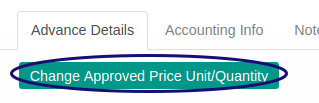
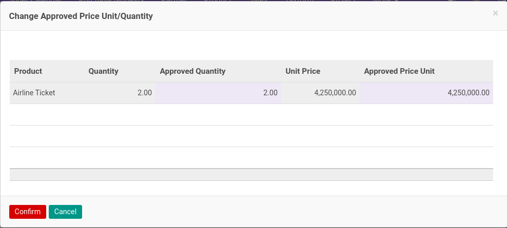
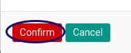

# Mengubah Nilai Cash Advance

## A. INPUT

* Data *Cash Advance* yang akan dirubah nilai Cash Advancenya harus memiliki status **Waiting For Approval**.

* User yang akan merubah nilai Cash Advance harus memiliki akses untuk **[Merubah detail Document](./penjelasan.md#field-can-change-detail)** Cash Advance.

## B. INSTRUKSI KERJA

1. Buka menu **Human Resources -> Cash Advance -> Cash Advance**. Abaikan jika sudah berada pada menu yang dimaksud.
2. Buka data Cash Advance yang nilainya akan diubah. Abaikan jika data sudah dibuka.
3. Klik tombol **Change Approved Price/Quantity** pada bagian atas-kiri detail Cash Advance.

4. Form Change Approved Price/Unit akan muncul

5. Ubah **[Approved Quantity](./penjelasan.md#field-approve-qty)** jika diperlukan.
6. Ubah **[Approved Price Unit](./penjelasan.md#field-approve-price)** jika diperlukan.
7. Klik tombol **Confirmed** pada bagian kiri bawah.

## C. OUTPUT

* Nilai Approved Quantity dan Nilai Approved Price Unit akan berubah sesuai dengan perubahan yang dilakukan

## Chapter
- [Transaksi](../../transaksi.md)
- [Penjelasan Cash Advance](./penjelasa.md)
- [Membuat Cash Advance](./membuat.md)
- [Modifikasi Cash Advance](./modifikasi.md)
- [Menghapus Cash Advance](./menghapus.md)
- [Menambah Detail Cash Advance](./membuat-detail.md)
- [Modifikasi Detail Cash Advance](./modifikasi-detail.md)
- [Menghapus Detail Cash Advance](./menghapus-detail.md)
- [Mengkonfirmasi Cash Advance](./mengkonfirmasi.md)
- [Menyetujui Cash Advance](./menyetujui.md)
- [Menolak Cash Advance](./menolak.md)
- [Merestart Persetujuan Cash Advance](./merestart-persetujuan.md)
- [Membatalkan Cash Advance](./membatalkan.md)
- [Merestart Cash Advance](./merestart.md)
- [Terminate Cash Advance](./terminate.md)
