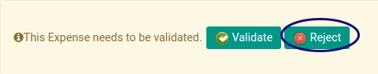

# Menolak Cash Advance

## A. INPUT

* Data *Cash Advance* yang akan ditolak harus memiliki status **Waiting For Approval**.

* User yang akan menolak harus memiliki akses untuk **[Menolak Document](./penjelasan.md#tab-reviews)** Cash Advance.

## B. INSTRUKSI KERJA

1. Buka menu **Human Resources -> Cash Advance -> Cash Advance**. Abaikan jika sudah berada pada menu yang dimaksud.
2. Buka data Cash Advance yang akan ditolak. Abaikan jika data sudah dibuka.
3. Klik tombol **Reject** pada bagian atas-kiri form.

## C. OUTPUT

* Data **[Reject](./penjelasan.md#tab-reviews)** pada tab review akan berisi nama user dan tanggal saat menolak.

## Chapter
- [Transaksi](../../transaksi.md)
- [Penjelasan Cash Advance](./penjelasa.md)
- [Membuat Cash Advance](./membuat.md)
- [Modifikasi Cash Advance](./modifikasi.md)
- [Menghapus Cash Advance](./menghapus.md)
- [Menambah Detail Cash Advance](./membuat-detail.md)
- [Modifikasi Detail Cash Advance](./modifikasi-detail.md)
- [Menghapus Detail Cash Advance](./menghapus-detail.md)
- [Mengkonfirmasi Cash Advance](./mengkonfirmasi.md)
- [Menyetujui Cash Advance](./menyetujui.md)
- [Merestart Persetujuan Cash Advance](./merestart-persetujuan.md)
- [Mengubah Nilai Cash Advance](./cash-advance/mengubah-nilai-cash-advance.md)
- [Membatalkan Cash Advance](./membatalkan.md)
- [Merestart Cash Advance](./merestart.md)
- [Terminate Cash Advance](./terminate.md)
