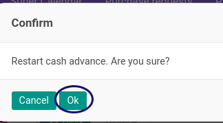

# Merestart Cash Advance

## A. INPUT

* Data *Cash Advance* yang akan direstart harus memiliki status **Cancel**.

* User yang akan merestart harus memiliki akses untuk **[Merestart Document](./penjelasan.md#field-can-restart)** cash advance.

## B. INSTRUKSI KERJA

1. Buka menu **Human Resources -> Cash Advance -> Cash Advance**. Abaikan jika sudah berada pada menu yang dimaksud.
2. Buka data cash advance yang akan direstart. Abaikan jika data sudah dibuka.
3. Klik tombol **Restart** pada bagian atas-kiri form.

5. Klik tombol **OK** pada bagian bawah kiri form.

## C. OUTPUT

* Data cash advance akan berubah menjadi **Draft**.

## Chapter
- [Transaksi](../../transaksi.md)
- [Penjelasan Cash Advance](./penjelasa.md)
- [Membuat Cash Advance](./membuat.md)
- [Modifikasi Cash Advance](./modifikasi.md)
- [Menghapus Cash Advance](./menghapus.md)
- [Menambah Detail Cash Advance](./membuat-detail.md)
- [Modifikasi Detail Cash Advance](./modifikasi-detail.md)
- [Menghapus Detail Cash Advance](./menghapus-detail.md)
- [Mengkonfirmasi Cash Advance](./mengkonfirmasi.md)
- [Menyetujui Cash Advance](./menyetujui.md)
- [Menolak Cash Advance](./menolak.md)
- [Merestart Persetujuan Cash Advance](./merestart-persetujuan.md)
- [Mengubah Nilai Cash Advance](./cash-advance/mengubah-nilai-cash-advance.md)
- [Membatalkan Cash Advance](./membatalkan.md)
- [Terminate Cash Advance](./terminate.md)
