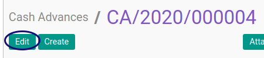
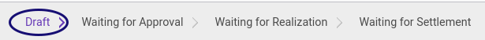

# Modifikasi Cash Advance

## A. INPUT

* Data **cash advance** yang akan dimodifikasi harus memiliki status **Draft**.

## B. INSTRUKSI KERJA

1. Buka menu **Human Resources -> Cash Advance -> Cash Advance**. Abaikan jika sudah berada pada menu yang dimaksud.
2. Buka data *cash advance* yang akan dimodifikasi. Abaikan jika data sudah dibuka.
3. Klik tombol **Edit** pada bagian atas-kiri form.

4. Ubah dan sesuaikan **[# Document](./penjelasan.md#field-document)** jika dibutuhkan. Harus diisi.
5. Ubah **[Employee](./penjelasan.md#field-employee)** jika dibutuhkan. Harus diisi.
6. Ubah **[Department](./penjelasan.md#field-department)** jika dibutuhkan. Tidak Harus diisi.
7. Ubah **[Manager](./penjelasan.md#field-manager)** jika dibutuhkan. Tidak Harus diisi.
8. Ubah **[Job Position](./penjelasan.md#field-job-position)** jika dibutuhkan. Tidak Harus diisi.
9. Ubah **[Date Request](./penjelasan.md#field-date-request)** jika dibutuhkan. Harus diisi.
10. Ubah **[Type](./penjelasan.md#field-type)** jika dibutuhkan. Harus diisi.
11. Ubah **[Currency](./penjelasan.md#field-currency)** jika dibutuhkan. Harus diisi.
12. Buka Tab **[Cash Advance Detail](./penjelasan.md#tab-detail)**.
13. <a name="l13">[Tambah](./membuat-detail.md)/[Modifikasi](./modifikasi-detail.md)/[Hapus](./menghapus-detail.md)</a> [**Cash Advance Detail**](./penjelasan.md#tab-detail). Lakukan sampai dengan anda selesai memasukkan semua **detail cash-advance** yang dibutuhkan.
14. Buka Tab **[Accounting Info](./penjelasan.md#tab-accounting)**.
15. Ubah dan sesuaikan **[Journal](./penjelasan.md#field-journal)** jika dibutuhkan. Harus diisi.
16. Ubah dan sesuaikan **[Emplyee Advance Payable Account](./penjelasan.md#field-payable-account)** jika dibutuhkan. Harus diisi.
17. Ubah dan sesuaikan **[Emplyee Advance Account](./penjelasan.md#field-advance-account)** jika dibutuhkan. Harus diisi.
18. Buka Tab **[Note](./penjelasan.md#tab-note)**.
19. Ubah **[Note](./penjelasan.md#field-tab-note-note)** jika dibutuhkan. Tidak harus diisi.
20. Klik tombol **Save** pada bagian atas-kiri form.

## C. OUTPUT

* Data Cash Advance akan tersimpan dengan status **Draft** sesuai perubahan.

## Chapter
- [Transaksi](../../transaksi.md)
- [Penjelasan Cash Advance](./penjelasan.md)
- [Membuat Cash Advance](./membuat.md)
- [Menghapus Cash Advance](./menghapus.md)
- [Menambah Detail Cash Advance](./membuat-detail.md)
- [Modifikasi Detail Cash Advance](./modifikasi-detail.md)
- [Menghapus Detail Cash Advance](./menghapus-detail.md)
- [Mengkonfirmasi Cash Advance](./mengkonfirmasi.md)
- [Menyetujui Cash Advance](./menyetujui.md)
- [Menolak Cash Advance](./menolak.md)
- [Merestart Persetujuan Cash Advance](./merestart-persetujuan.md)
- [Mengubah Nilai Cash Advance](./cash-advance/mengubah-nilai-cash-advance.md)
- [Membatalkan Cash Advance](./membatalkan.md)
- [Merestart Cash Advance](./merestart.md)
- [Terminate Cash Advance](./terminate.md)
