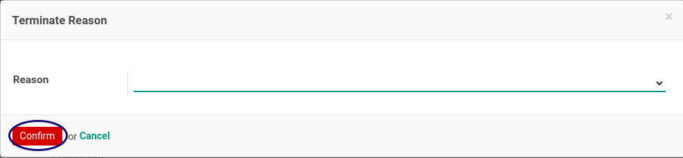

# Penjelasan Cash Advance

Informasi pada **Cash Advance**  dibagi menjadi beberapa area, diantaranya:
* [Header](#bagian-header)
* [Tab Advance Detail](#tab-detail)
* [Tab Accounting Info](#tab-accounting)
* [Tab Reviews](#tab-reviews)
* [Tab Note](#tab-note)
* [Tab Policies](#tab-policy)
* [Tab Logs](#tab-log)

Form lainnya yang muncul pada proses cash advance
* [Form Pembatalan](#form-batal)
* [Form Terminate](#form-terminate)

### <a name="bagian-header">HEADER</a>

#### <a name="field-document"># Document</a>

Nomor dokumen.

#### <a name="field-employee">Employee</a>

Karyawan.

#### <a name="field-department">Department</a>

Unit kerja karyawan ketika membuat reimbursement. Secara default isian akan sesuai dengan isian Department dari data Employee yang dipilih. Pilihan diambil dari master data Department.

#### <a name="field-manager">Manager</a>

Atasan karyawan ketika membuat reimbursement. Secara default isian akan sesuai dengan isian Manager dari data Employee yang dipilih. Pilihan diambil dari master data Employee.

#### <a name="field-job-position">Job Position</a>

Posisi karyawan ketika membuat reimbursement. Secara default isian akan sesuai dengan isian Job Position dari data Employee yang dipilih. Pilihan diambil dari master data Job Position.

#### <a name="field-date-request">Date Request</a>

Tanggal terjadinya permintaan/*request*.

#### <a name="field-type">Type</a>

Jenis cash advance. Pilihan diambil dari master data **type cash advance**.

#### <a name="field-currency">Currency</a>

Mata Uang. Pilihan diambil dari master data **currency**.

### <a name="tab-detail">Tab Advance Detail</a>

#### <a name="field-product">Product</a>

Nama produk yang akan dicash advance. Pilihan diambil dari master data Product.

#### <a name="field-unit-price">Unit Price</a>

Harga satuan produk yang akan dicash advance.

#### <a name="field-approve-price">Aprroved Price Unit</a>

Harga yang disetujui dari produk yang dicash advance. Tidak bisa diubah langsung. Isian dapat diubah dengan menjalankan instruksi kerja [Mengubah Nilai Cash Advance](./mengubah-nilai-cash-advance.md)

#### <a name="field-qty">Qty</a>

Jumlah produk yang akan dicash advance.

#### <a name="field-approve-qty">Aprroved Quantity</a>

Jumlah produk yang disetujui untuk dicash advance. Tidak bisa diubah langsung. Isian dapat diubah dengan menjalankan instruksi kerja [Mengubah Nilai Cash Advance](./mengubah-nilai-cash-advance.md)

#### <a name="field-uom">UoM</a>

Satuan/Unit of Measurement dari produk yang dicash advance. Secara default isian akan sesuai dengan isian *UoM* dari data **Product** yang dipilih. Pilihan diambil dari master data **Unit of Measure**.

#### <a name="field-sub-total">Sub Total</a>

Perkalian antara **Aprroved Quantity** dan **Aprroved Price Unit**. Akan terhitung secara otomatis.

#### <a name="field-total">Total</a>

Jumlah total cash advance yang harus dibayarkan. Akan terhitung secara otomatis.

#### <a name="field-total-payment">Total Payment</a>

Akan terhitung secara otomatis.

#### <a name="field-total-residu">Total Residual</a>

Selisih Total dan Total Payment. Akan terhitung secara otomatis.

#### <a name="field-total-realized">Total Realized</a>

Akan terhitung secara otomatis.

#### <a name="field-total-due">Total Due</a>

Total Due merupakan selisih **Total Payment** dan **Total Realized**. Akan terhitung secara otomatis.

### <a name="tab-accounting">Tab Accounting Info</a>

#### <a name="field-journal">Journal</a>

Buku Jurnal yang akan digunakan dalam pembuatan penjurnalan akuntansi. Secara default isian akan sesuai dengan isian **Journal** dari **Type** yang dipilih. Pilihan diambil dari master data **Journal**.

#### <a name="field-payable-account">Employee Advance Payable Account</a>

Akun utang (payable) yang akan digunakan dalam pembuatan penjurnalan akuntansi. Secara default isian akan sesuai dengan isian **Employee Advance Payable Account** dari **Type** yang dipilih. Pilihan diambil dari master data **account**.

#### <a name="field-advance-account">Employee Advance Account</a>

Akun cash advance yang akan digunakan dalam pembuatan penjurnalan akuntansi. Secara default isian akan sesuai dengan isian **Employee Advance Account** dari **Type** yang dipilih. Pilihan diambil dari master data **account**.

#### <a name="field-move"># Move</a>

Penjurnalan akuntansi yang dihasilkan. Akan terisi otomatis ketika cash advance disetujui.

#### <a name="field-move-payable-line">Employee Advance Payable Move Line</a>

Detail penjurnalan akuntansi untuk payable. Akan terisi otomatis ketika cash advance disetujui.

#### <a name="field-move-advance-line">Employee Advance Move Line</a>

Detail penjurnalan akuntansi untuk cash advance. Akan terisi otomatis ketika cash advance disetujui.

### <a name="tab-reviews">Tab Reviews</a>

#### <a name="field-definition">Definition</a>

Konfigurasi multiple approval yang digunakan. Secara default akan terisi otomatis sesuai dengan keadaan cash-advance ketika cash-advance dikonfirmasi.

#### <a name="field-review-validation">Review Partner Validation</a>

Daftar User yang berhak melakukan validasi sesuai **Definition** yang ditetapkan. Akan terisi otomatis.

### <a name="tab-note">Tab Note</a>

#### <a name="field-tab-note-note">Note</a>

Catatan lebih detail mengenai cash-advance.

### <a name="tab-policy">Tab Policies</a>

#### <a name="field-can-confirm">Can Confirm</a>

Berhak atau tidaknya user untuk mengkonfirmasi cash advance.

#### <a name="field-can-restart-approval">Can Restart Approval</a>

Berhak atau tidaknya user untuk merestart persetujuan cash advance

#### <a name="field-can-cancel">Can Cancel</a>

Berhak atau tidaknya user untuk membatalkan cash advance

#### <a name="field-can-terminate">Can Terminate</a>

Berhak atau tidaknya user untuk menterminasi cash advance

#### <a name="field-can-restart">Can Restart</a>

Berhak atau tidaknya user untuk merestart cash advance

### <a name="tab-log">Tab Logs</a>

Tab Log berisikan informasi log mengenai nama dan tanggal proses

#### <a name="field-log-confirmation">Confirmation</a>

User yang mengkonfirmasi dan waktu konfirmasi.

#### <a name="field-log-approval">Approval</a>

User yang menyetujui dan waktu persetujuan.

#### <a name="field-log-open">Open</a>

User yang merealisasi cash advance dan waktu realisasi.

#### <a name="field-log-finish">Finish</a>

User yang melakukan penyelesaian dan waktu penyelesaian.

#### <a name="field-log-cancel">Cancellation</a>

User yang membatalkan dan waktu pembatalan.

#### <a name="field-log-terminate">Terminate</a>

User yang menterminasi dan waktu terminasi.

### <a name="form-batal">Form Pembatalan</a>

Form ini muncul saat transaksi pembatalan/cancel dilakukan

#### <a name="field-cancel-reason">Reason</a>

Definisikan alasan pembatalan

### <a name="form-terminate">Form Terminate</a>

Form ini muncul saat proses terminate dilakukan

#### <a name="field-terminate-reason">Reason</a>

Definisikan alasan terminate

## Chapter
- [Transaksi](../../transaksi.md)
- [Penjelasan Cash Advance](./penjelasa.md)
- [Membuat Cash Advance](./membuat.md)
- [Modifikasi Cash Advance](./modifikasi.md)
- [Menghapus Cash Advance](./menghapus.md)
- [Menambah Detail Cash Advance](./membuat-detail.md)
- [Modifikasi Detail Cash Advance](./modifikasi-detail.md)
- [Menghapus Detail Cash Advance](./menghapus-detail.md)
- [Mengkonfirmasi Cash Advance](./mengkonfirmasi.md)
- [Menyetujui Cash Advance](./menyetujui.md)
- [Menolak Cash Advance](./menolak.md)
- [Merestart Persetujuan Cash Advance](./merestart-persetujuan.md)
- [Mengubah Nilai Cash Advance](./cash-advance/mengubah-nilai-cash-advance.md)
- [Membatalkan Cash Advance](./membatalkan.md)
- [Merestart Cash Advance](./merestart.md)
- [Terminate Cash Advance](./terminate.md)
