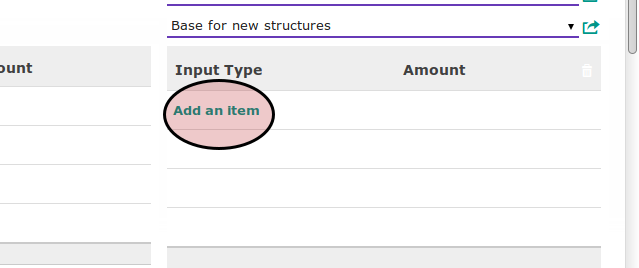

# Menambahkan Payslip Input

*(Instruksi kerja ini merupakan sub instruksi dari (1) [Membuat Demotion Transition](./membuat.md), atau (2) [Memodifikasi Demotion Transition](./modifikasi.md). Instruksi kerja ini tidak bisa berdiri sendiri)*

## A. INPUT

*(Tidak ada prasyarat khusus)*

## B. INSTRUKSI KERJA

1. <a name="l1">Klik</a> tombol **Add an Item** pada tabel [**Payslip Input**](./penjelasan.md#tabel-input-types).

2. Pilih **[Input Type](./penjelasan.md#field-transisi-input-type)**. Harus diisi.
3. Isi **[Amount](./penjelasan.md#field-transisi-input-type-amount)**. Harus diisi.
4. Ulangi [langkah ke-1](#l1) untuk setiap payslip input yang akan ditambahkan.
5. Lanjutkan [langkah ke-17 instruksi Membuat Demotion Transition](./membuat.md#l17) atau [langkah ke-18 instruksi Memodifikasi Demotion Transition](./modifikasi.md#l18).

## C. OUTPUT

*(Tidak ada instruksi khusus)*

