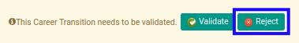

# Menolak Demotion Transition

## A. INPUT

* Data *demotion transition* yang akan ditolak harus memiliki status **Waiting for Approval**.

* User yang akan menolak harus memiliki akses untuk menolak *demotion transition*.

## B. INSTRUKSI KERJA

1. Buka menu **Human Resources -> Career Transition -> Demotions**. Abaikan jika sudah berada pada menu yang dimaksud.
2. Buka data *demotion transition* yang akan ditolak. Abaikan jika data sudah dibuka.
3. Klik tombol **Reject** pada bagian atas-kiri form.

## C. OUTPUT

* Data *demotion transition* telah ditolak.

