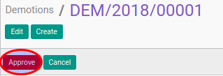

# Menyetujui Demotion Transition

## A. INPUT

* Data demotion transition yang akan disetujui harus memiliki status **Waiting for Approval**.

* User yang akan menyetujui harus memiliki akses untuk menyetujui demotion transition.

## B. INSTRUKSI KERJA

1. Buka menu **Human Resources -> Career Transition -> Demotions**. Abaikan jika sudah berada pada menu yang dimaksud.
2. Buka data demotion transition yang akan disetujui. Abaikan jika data sudah dibuka.
3. Klik tombol **Approve** pada bagian atas-kiri form.

## C. OUTPUT

* Data demotion transition akan berubah menjadi **On Progress**.

