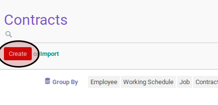

# Membuat Employee Contract

## A. INPUT

*(Tidak ada prasyarat khusus)*

## B. INSTRUKSI KERJA

1. Buka menu **Human Resources -> Human Resources -> Contracts**. Abaikan jika sudah berada pada menu yang dimaksud.
2. Klik tombol **Create** pada bagian atas-kiri form.

3. Pilih **Employee**. Harus diisi.
4. Pilih **Company**. Harus diisi.
5. Pilih **Department**. Tidak harus diisi.
6. Pilih **Job Title**. Tidak harus diisi.
7. Pilih **Job Grade**. Tidak harus diisi.
8. Pilih **Contract Type**. Harus diisi.
9. Buka tab **Information**.
10. Isi **Wage**. Tidak harus diisi.
11. Pilih **Salary Structure**. Tidak harus diisi.
12. Isi **Contract Start Duration**. Tidak harus diisi.
13. Isi **Contract End Duration**. Tidak harus diisi.
14. Pilih **Working Schedule**. Tidak harus diisi.
15. Pilih **Scheduled Pay**. Tidak harus diisi.
16. Pilih **Analytic Account**. Tidak harus diisi.
17. Pilih **Salary Journal**. Tidak harus diisi.
18. Isi **Notes**.
19. Buka tab **Timesheet Computation**.
20. <a name="l20">[Tambahkan](./menambah-timesheet-computation.md)/[Modifikasi](./modifikasi-timesheet-computation.md)/[Hapus](./menghapus-timesheet-computation.md)</a> **Timesheet Computation**.
21. Buka tab **Payslip Inputs**.
22. <a name="l22">[Tambahkan](./menambah-payslip-input.md)/[Modifikasi](./modifikasi-payslip-input.md)/[Hapus](./hapus-payslip-input.md)</a> **Payslip Inputs**.
23. Klik tombol **Save** pada bagian atas-kiri form

## C. OUTPUT

* Data employee contract akan terbuat.
