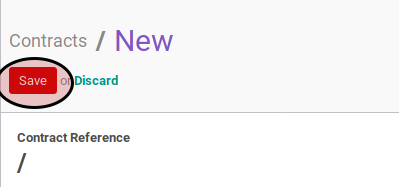

# Membuat Employee Contract

## A. INPUT

*(Tidak ada prasyarat khusus)*

## B. INSTRUKSI KERJA

1. Buka menu **Human Resources -> Human Resources -> Contracts**. Abaikan jika sudah berada pada menu yang dimaksud.
2. Klik tombol **Create** pada bagian atas-kiri form.

3. Pilih **[Employee](./penjelasan.md#field-employee)**. Harus diisi.
4. Pilih **[Company](./penjelasan.md#field-company)**. Harus diisi.
5. Pilih **[Department](./penjelasan.md#field-department)**. Tidak harus diisi.
6. Pilih **[Job Title](./penjelasan.md#field-job-title)**. Tidak harus diisi.
7. Pilih **[Job Grade](./penjelasan.md#field-job-grade)**. Tidak harus diisi.
8. Pilih **[Contract Type](./penjelasan.md#field-contract-type)**. Harus diisi.
9. Buka tab **Information**.
10. Isi **[Wage](./penjelasan.md#field-wage)**. Tidak harus diisi.
11. Pilih **[Salary Structure](./penjelasan.md#field-salary-structure)**. Tidak harus diisi.
12. Isi **[Contract Start Duration](./penjelasan.md#field-duration)**. Tidak harus diisi.
13. Isi **[Contract End Duration](./penjelasan.md#field-duration)**. Tidak harus diisi.
14. Pilih **[Working Schedule](./penjelasan.md#field-working-schedule)**. Tidak harus diisi.
15. Pilih **[Schedule Pay](./penjelasan.md#field-schedule-pay)**. Tidak harus diisi.
16. Pilih **[Analytic Account](./penjelasan.md#field-analytic-account)**. Tidak harus diisi.
17. Pilih **[Salary Journal](./penjelasan.md#field-salary-journal)**. Tidak harus diisi.
18. Isi **[Notes](./penjelasan.md#field-notes)**.
19. Buka tab **Timesheet Computation**.
20. <a name="l20">[Tambahkan](./menambah-timesheet-computation.md)/[Modifikasi](./modifikasi-timesheet-computation.md)/[Hapus](./menghapus-timesheet-computation.md)</a> **Timesheet Computation**.
21. Buka tab **Payslip Inputs**.
22. <a name="l22">[Tambahkan](./menambah-payslip-input.md)/[Modifikasi](./modifikasi-payslip-input.md)/[Hapus](./hapus-payslip-input.md)</a> **Payslip Inputs**.
23. Klik tombol **Save** pada bagian atas-kiri form

## C. OUTPUT

* Data employee contract akan terbuat.
