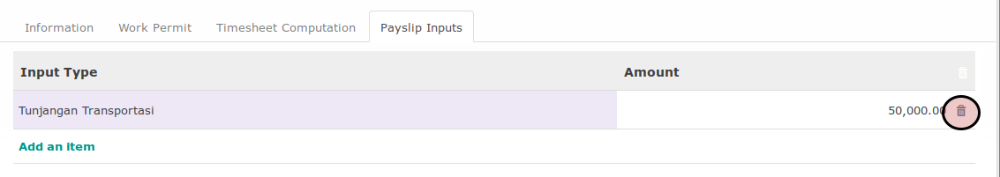

# Menghapus Payslip Input

*(Instruksi kerja ini merupakan sub instruksi dari (1) [Membuat Employee Contract](./membuat.md), atau (2) [Memodifikasi Employee Contract](./modifikasi.md). Instruksi kerja ini tidak bisa berdiri sendiri)*

## A. INPUT

*(Tidak ada prasyarat khusus)*

## B. INSTRUKSI KERJA

1. Buka tab **Payslip Inputs**.
2. <a name="l2">Klik</a> icon tempat sampah pada bagian kanan data payslip input yang akan dihapus.

3. Ulangi [langkah ke-2](#l2) untuk setiap payslip input yang akan dihapus.
4. Lanjutkan [langkah ke-20 instruksi Membuat Employee Contract](./membuat.md#l20) atau [langkah ke-21 instruksi Memodifikasi Employee Contract](./modifikasi.md#l21).

## C. OUTPUT

*(Tidak ada instruksi khusus)*
