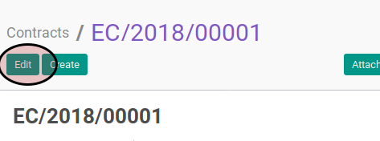
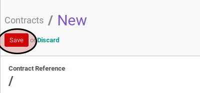

# Memodifikasi Employee Contract

## A. INPUT

*(Tidak ada prasyarat khusus)*

## B. INSTRUKSI KERJA

1. Buka menu **Human Resources -> Human Resources -> Contracts**. Abaikan jika sudah berada pada menu yang dimaksud.
2. Buka data employee contract yang akan dimodifikasi. Abaikan jika data sudah dibuka.
3. Klik tombol **Edit** pada bagian atas-kiri form.

4. Pilih **[Employee](./penjelasan.md#field-employee)**. Harus diisi.
5. Pilih **[Company](./penjelasan.md#field-company)**. Harus diisi.
6. Pilih **[Department](./penjelasan.md#field-department)**. Tidak harus diisi.
7. Pilih **[Job Title](./penjelasan.md#field-job-title)**. Tidak harus diisi.
8. Pilih **[Job Grade](./penjelasan.md#field-job-grade)**. Tidak harus diisi.
9. Pilih **[Contract Type](./penjelasan.md#field-contract-type)**. Harus diisi.
10. Buka tab **Information**.
11. Isi **[Wage](./penjelasan.md#field-wage)**. Tidak harus diisi.
12. Pilih **[Salary Structure](./penjelasan.md#field-salary-structure)**. Tidak harus diisi.
13. Isi **[Contract Start Duration](./penjelasan.md#field-duration)**. Tidak harus diisi.
14. Isi **[Contract End Duration](./penjelasan.md#field-duration)**. Tidak harus diisi.
15. Pilih **[Working Schedule](./penjelasan.md#field-working-schedule)**. Tidak harus diisi.
16. Pilih **[Schedule Pay](./penjelasan.md#field-schedule-pay)**. Tidak harus diisi.
17. Pilih **[Analytic Account](./penjelasan.md#field-analytic-account)**. Tidak harus diisi.
18. Pilih **[Salary Journal](./penjelasan.md#field-salary-journal)**. Tidak harus diisi.
19. Isi **[Notes](./penjelasan.md#field-notes)**.
20. Buka tab **Timesheet Computation**.
21. <a name="l21">[Tambahkan](./menambah-timesheet-computation.md)/[Modifikasi](./modifikasi-timesheet-computation.md)/[Hapus](./menghapus-timesheet-computation.md)</a> **Timesheet Computation**.
22. Buka tab **Payslip Inputs**.
23. <a name="l23">[Tambahkan](./menambah-payslip-input.md)/[Modifikasi](./modifikasi-payslip-input.md)/[Hapus](./hapus-payslip-input.md)</a> **Payslip Inputs**.
24. Klik tombol **Save** pada bagian atas-kiri form

## C. OUTPUT

*(Tidak ada instruksi khusus)*
