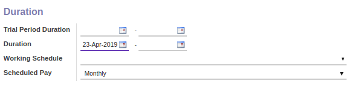

# Penjelasan Employee Contract

Informasi pada Employee Contract dibagi menjadi beberapa area, diantaranya:
* [Header](#bagian-header)
* [Tab Information](#tab-information)
* [Tab Work Permit](#tab-employee-code)
* [Tab Timesheet Computation](#tab-timesheet-computation)
* [Tab Payslip Inputs](#tab-payslip-inputs)

### <a name="bagian-header">HEADER</a>

#### <a name="field-contract-ref">Contract Reference</a>

Nomor referensi dari kontrak karyawan

#### <a name="field-employee">Employee</a>

Mendefinisikan karyawan yang akan dibuatkan kontrak

#### <a name="field-contract-type">Contract Type</a>

Mendefinisikan tipe kontrak karyawan

#### <a name="field-company">Company</a>

Mendefinisikan perusahaan tempat karyawan bekerja

#### <a name="field-department">Department</a>

Mendefinisikan departemen/divisi tempat karyawan bekerja

#### <a name="field-job-title">Job Title</a>

Mendefinisikan jabatan pekerjaan karyawan

#### <a name="field-job-grade">Job Grade</a>

Mendefinisikan tingkata jabatan karyawan

### <a name="tab-information">TAB INFORMATION</a>

### <a name="info-salary-advantages">Salary and Advantages</a>

#### <a name="field-wage">Wage</a>

Jumlah gaji karyawan yang akan dibayarkan perusahaan

#### <a name="field-salary-structure">Salary Structure</a>

#TODO

#### <a name="field-advantages">Advantages</a>

Keuntungan-keuntungan yang akan didapat oleh karyawan

### <a name="info-employee-benefits">Employee Benefits</a>

#### <a name="field-benefit">Benefit</a>

Nama tunjangan yang akan diberikan kepada karyawan

#### <a name="field-rate">Rate</a>

Nilai rate terkait tunjangan karyawan

#### <a name="field-employee-amount">Employee Amount</a>

#TODO

#### <a name="field-employeer-amount">Employeer Amount</a>

#TODO

#### <a name="field-amount-type">Amount Type</a>

#TODO

#### <a name="field-start-date">Start Date</a>

Menentukan tanggal mulai berlakunya tunjangan terkait

#### <a name="field-amount-type">End Date</a>

Menentukan tanggal akhir berlakunya tunjangan terkait

### <a name="info-duration">Duration</a>

#### <a name="field-trial-period-duration">Trial Period Duration</a>

Menentukan tanggal mulai dan akhir masa percobaan kerja karyawan

#### <a name="field-duration">Duration</a>

Menentukan tanggal mulai dan akhir terkait kontrak karyawan

#### <a name="field-working-schedule">Working Schedule</a>

Mendefinisikan jadwal kerja karyawan

#### <a name="field-working-schedule">Schedule Pay</a>

Mendefinisikan jadwal pembayaran gaji karyawan

### <a name="info-accounting">Accounting</a>

#### <a name="field-analytic-account">Analytic Account</a>

Mendefinisikan akun analitik yang digunakan

#### <a name="field-salary-journal">Salary Journal</a>

Mendefinisikan jurnal gaji yang digunakan

### <a name="info-notes">Notes</a>

#### <a name="field-notes">Notes</a>

Catatan tambahan terkait kontrak karyawan

### <a name="tab-work-permit">TAB WORK PERMIT</a>

#### <a name="field-visa-no">Visa No</a>

Nomor visa karyawan

#### <a name="field-visa-no">Visa Expire Date</a>

Tanggal berakhirnya masa berlaku visa

#### <a name="field-work-permit-no">Work Permit No</a>

Nomor surat ijin kerja karyawan

### <a name="tab-timesheet-computation">TAB TIMESHEET COMPUTATION</a>

#### <a name="field-computation-item">Computation Item</a>

Mendefinisikan komputasi timesheet yang akan digunakan

### <a name="tab-payslip-inputs">TAB PAYSLIP INPUTS</a>

#### <a name="field-input-type">Input Type</a>

#TODO

#### <a name="field-input-type-amount">Amount</a>

Jumlah input type
