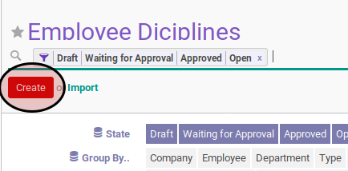
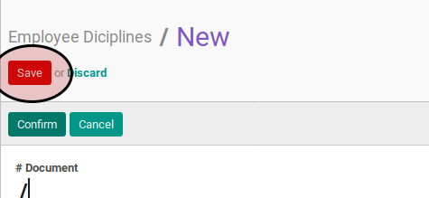

# Membuat Employee Dicipline

### A. INPUT

*(Tidak ada instruksi khusus)*

### B. PETUNJUK KERJA

1. Buka menu **Human Resource -> Employee Dicipline -> Employee Dicipline**.
2. Klik tombol **Create** pada bagian atas-kiri form.

3. Pilih dan sesuaikan **[Company](../employee-dicipline.md#field-company)** jika dibutuhkan. Harus diisi.
4. Isi **[Efective Date](../employee-dicipline.md#field-effective-date)**. Harus diisi.
5. Pilih **[Employee](../employee-dicipline.md#field-employee)**. Harus diisi.
6. Pilih **[Type](../employee-dicipline.md#field-type)**. Harus diisi.
7. Pilih **[Reason](../employee-dicipline.md#field-reason)**. Harus diisi.
8. Buka tab **Note**
9. Isi **[Note](../employee-dicipline.md#field-note)**. Tidak harus diisi.
10. <a name="l10">Apabila</a> ada denda yang menyertai sanksi, maka lakukan prosedur [denda](./membuat-fine.md)
11. Klik tombol **Save** pada bagian atas-kiri form

### C. OUTPUT

* Data employee dicipline akan terbuat dengan status **Draft**.

