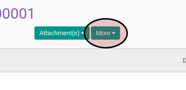
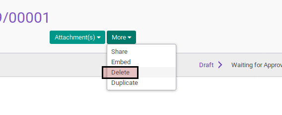
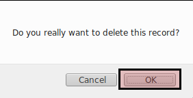

# Menghapus Employee Dicipline

## A. INPUT

* Data employee dicipline yang akan dihapus harus memiliki status **Draft**.

## B. LANGKAH KERJA

1. Buka menu **Human Resources -> Employee Dicipline -> Employee Dicipline**. Abaikan jika sudah berada pada menu yang dimaksud.
2. Buka data employee dicipline yang akan dimodifikasi. Abaikan jika data sudah dibuka.
3. Klik tombol **More** pada bagian atas-tengah form.

4. Klik tombol **Delete** pada drop-down yang muncul dari tombol **More**.

5. Klik tombol **Ok** pada konfirmasi penghapusan yang muncul

## C. OUTPUT

* Data employee dicipline akan terhapus.
