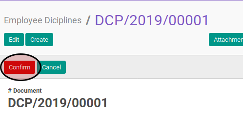
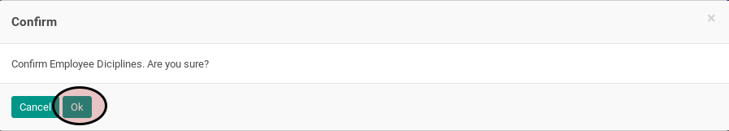

# Mengkonfirmasi Employee Dicipline

## A. INPUT

* Data employee dicipline yang akan dikonfirmasi harus memiliki status **Draft**.

* User yang akan mengkonfirmasi harus memiliki akses untuk mengkonfirmasi employee dicipline.

## B. INSTRUKSI KERJA

1. Buka menu **Human Resource -> Employee Dicipline -> Employee Dicipline**. Abaikan jika sudah berada pada menu yang dimaksud.
2. Buka data employee dicipline yang akan dikonfirmasi. Abaikan jika data sudah dibuka.
3. Klik tombol **Confirm** pada bagian atas-kiri form.

4. Klik tombol **Ok** pada dialog konfirmasi yang muncul.

## C. OUTPUT

* Data employee dicipline akan berubah menjadi **Waiting for Approval**.

* Data employee dicipline sudah tidak bisa dimodifikasi.
