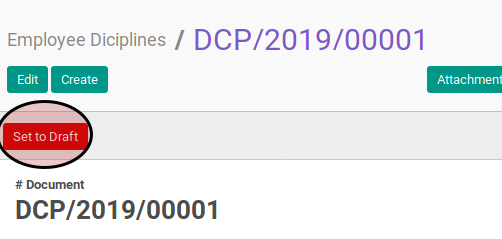
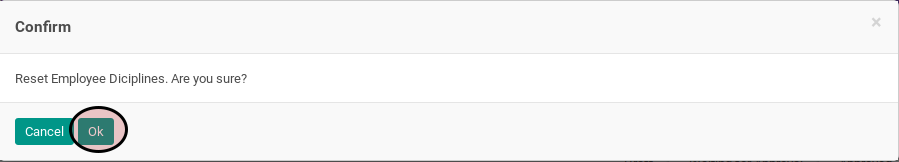
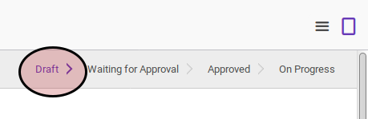

# Merestart Employee Dicipline

## A. INPUT

* Data employee dicipline yang akan direstart harus memiliki status **Cancelled**.

* User yang akan merestart harus memiliki akses untuk merestart employee dicipline.

## B. INSTRUKSI KERJA

1. Buka menu **Human Resource -> Employee Dicipline -> Employee Dicipline**. Abaikan jika sudah berada pada menu yang dimaksud.
2. Buka data employee dicipline yang akan direstart. Abaikan jika data sudah dibuka.
3. Klik tombol **Set To Draft** pada bagian atas-kiri form.

4. Klik tombol **Ok** pada dialog konfirmasi yang muncul.

## C. OUTPUT

* Data employee dicipline akan berubah menjadi **Draft**.

