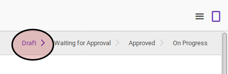

# Memodifikasi Employee Dicipline

### A. INPUT

* Data employee dicipline yang akan dimodifikasi harus memiliki status **Draft**.

### B. PETUNJUK KERJA

1. Buka menu **Human Resource -> Employee Dicipline -> Employee Dicipline**. Abaikan jika sudah berada pada menu yang dimaksud.
2. Buka data employee dicipline yang akan dimodifikasi. Abaikan jika data sudah dibuka.
3. Klik tombol **Edit** pada bagian atas-kiri form.

4. Pilih dan sesuaikan **[Company](../employee-dicipline.md#field-company)** jika dibutuhkan. Harus diisi.
5. Isi dan sesuaikan **[Efective Date](../employee-dicipline.md#field-effective-date)** jika dibutuhkan. Harus diisi.
6. Pilih dan sesuaikan **[Employee](../employee-dicipline.md#field-employee)** jika dibutuhkan. Harus diisi.
7. Pilih dan sesuaikan **[Type](../employee-dicipline.md#field-type)** jika dibutuhkan. Harus diisi.
8. Pilih dan sesuaikan **[Reason](../employee-dicipline.md#field-reason)** jika dibutuhkan. Harus diisi.
9. Buka tab **Note**
10. Isi dan sesuaikan **[Note](../employee-dicipline.md#field-note)** jika dibutuhkan. Tidak harus diisi.
11. <a name="l11">Apabila</a> ada denda yang menyertai sanksi, maka lakukan prosedur [denda](./membuat-fine.md)
12. Klik tombol **Save** pada bagian atas-kiri form

### C. OUTPUT

* Data employee dicipline berubah sesuai dengan perubahan yang dilakukan.
