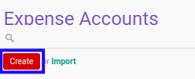
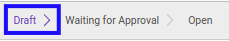

# Membuat Expense Account

## A. INPUT

*(Tidak ada instruksi khusus)*

## B. LANGKAH KERJA

1. Buka menu **Human Resources -> Expense Account -> Expense Accounts**. Abaikan jika sudah berada pada menu yang dimaksud.
2. Klik tombol **Create** pada bagian atas-kiri form.

3. Ubah **[# Document](./penjelasan.md#field-no-document)** dengan penomeran yang dikehendaki. Biarkan berisi **/** apabila menghendaki penomeran otomatis.
4. Pilih **[Employee](./penjelasan.md#field-employee)**. Wajib diisi.
5. Pilih **[Department](./penjelasan.md#field-department)**. Tidak wajib diisi.
6. Pilih **[Manager](./penjelasan.md#field-manager)**. Tidak wajib diisi.
7. Pilih **[Job Position](./penjelasan.md#field-job-position)**. Tidak wajib diisi.
8. Pilih **[Type](./penjelasan.md#field-type)**. Wajib diisi.
9. Pilih **[Currency](./penjelasan.md#field-currency)**. Wajib diisi.
10. Pilih **[Date Assign](./penjelasan.md#field-date-assign)**. Wajib diisi.
11. Pilih **[Date Expire](./penjelasan.md#field-date-expire)**. Tidak wajib diisi.
12. Beralih ke tab **[Expense](./penjelasan.md#tab-expense)**.
13. Isi **[Amount Limit](./penjelasan.md#field-amount-limit)**. Wajib diisi.
14. Beralih ke tab **[Notes](./penjelasan.md#tab-notes)**.
15. Isi **[Notes](./penjelasan.md#field-notes)**. Tidak wajib diisi.
16. Klik tombol **Save** pada bagian atas-kiri form.

## C. OUTPUT

* Data *expense account* akan terbuat dengan status **Draft**

