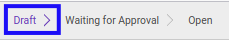

# Mengedit Expense Account

## A. INPUT

* Data *Expense Account* yang dapat dimodifikasi harus memiliki status **Draft**.

* User yang akan memodifikasi harus memiliki akses untuk memodifikasi *Expense Account*.

## B. LANGKAH KERJA

1. Buka menu **Human Resources -> Expense Account -> Expense Accounts**. Abaikan jika sudah berada pada menu yang dimaksud.
2. Buka data *Expense Account* yang akan dimodifikasi. Abaikan jika data sudah dibuka.
3. Klik tombol **Edit** pada bagian atas-kiri form.

4. Ubah **[# Document](./penjelasan.md#field-no-document)** dengan penomeran yang dikehendaki. Biarkan berisi **/** apabila menghendaki penomeran otomatis.
5. Pilih dan sesuaikan **[Employee](./penjelasan.md#field-employee)** jika dibutuhkan. Wajib diisi.
6. Pilih dan sesuaikan **[Department](./penjelasan.md#field-department)** jika dibutuhkan. Tidak wajib diisi.
7. Pilih dan sesuaikan **[Manager](./penjelasan.md#field-manager)** jika dibutuhkan. Tidak wajib diisi.
8. Pilih dan sesuaikan **[Job Position](./penjelasan.md#field-job-position)** jika dibutuhkan. Tidak wajib diisi.
9. Pilih dan sesuaikan **[Type](./penjelasan.md#field-type)** jika dibutuhkan. Wajib diisi.
10. Pilih dan sesuaikan **[Currency](./penjelasan.md#field-currency)** jika dibutuhkan. Wajib diisi.
11. Pilih dan sesuaikan **[Date Assign](./penjelasan.md#field-date-assign)** jika dibutuhkan. Wajib diisi.
12. Pilih dan sesuaikan **[Date Expire](./penjelasan.md#field-date-expire)** jika dibutuhkan. Tidak wajib diisi.
13. Beralih ke tab **[Expense](./penjelasan.md#tab-expense)**.
14. Isi dan sesuaikan **[Amount Limit](./penjelasan.md#field-amount-limit)** jika dibutuhkan. Wajib diisi.
15. Beralih ke tab **[Reimbursement](./penjelasan.md#tab-reimbursement)**.
16. <a name="l16">[Tambah](./menambahkan-reimbursement.md)/[Edit](./mengedit-reimbursement.md)/[Hapus](./menghapus-reimbursement.md) **Reimbursement**</a>. Ulangi langkah ini sampai **Reimbursement** sesuai dengan keinginan.
17. Beralih ke tab **[Notes](./penjelasan.md#tab-notes)**.
18. Isi dan sesuaikan **[Notes](./penjelasan.md#field-notes)** jika dibutuhkan. Tidak wajib diisi.
19. Klik tombol **Save** pada bagian atas-kiri form.

## C. OUTPUT

* Data *Expense Account* akan berubah sesuai dengan perubahan yang dilakukan.
