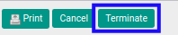
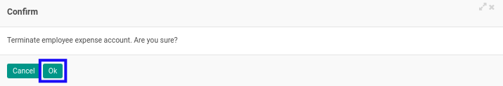
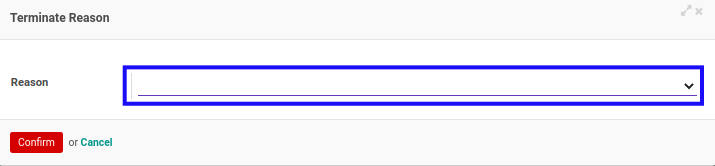
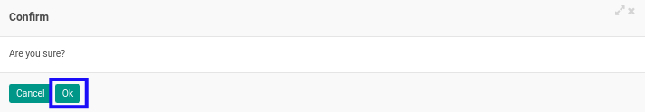

# Menghentikan Expense Account

## A. INPUT

* Data *Expense Account* yang akan dihentikan harus memiliki status **Open**.

* User yang akan menghentikan harus memiliki akses untuk menghentikan *Expense Account*.

## B. LANGKAH KERJA

1. Buka menu **Human Resources -> Expense Account -> Expense Accounts**. Abaikan jika sudah berada pada menu yang dimaksud.
2. Buka data *Expense Account* yang akan dihentikan. Abaikan jika data sudah dibuka.
3. Klik tombol **Terminate** pada bagian atas-kiri form.

4. Klik tombol **Ok** pada *pop-up* konfirmasi penghentian yang muncul.

5. Pilih **Reason** pada *pop-up* **Terminate Reason** yang muncul.

6. Klik tombol **Confirm** pada *pop-up* Terminate Reason.

7. Klik tombol **Ok** pada *pop-up* konfirmasi penghentian yang muncul.

## C. OUTPUT

* Status dari *Expense Account* akan berubah menjadi **Terminated**

