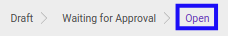

# Menyetujui Expense Account

* Data *Expense Account* yang akan disetujui harus memiliki status **Waiting for Approval**.

* User yang akan menyetujui harus memiliki akses untuk menyetujui *Expense Account*.

## B. LANGKAH KERJA

1. Buka menu **Human Resources -> Expense Account -> Expense Accounts**. Abaikan jika sudah berada pada menu yang dimaksud.
2. Buka data *Expense Account* yang akan disetujui. Abaikan jika data sudah dibuka.
3. Klik tombol **Validate** pada bagian atas-kiri form.

## C. OUTPUT

* Status dari *Expense Account* akan berubah menjadi **Open**.

