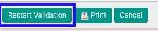
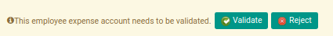

# Merestart Persetujuan Expense Account

## A. INPUT

* *Expense Account* yang dapat direstart persetujuan harus memiliki status **Waiting for Approval**.

* *Expense Account* yang dapat direstart persetujuan harus memiliki kondisi **Operation has been rejected**.

* User yang akan merestart persetujuan harus memiliki akses untuk merestart persetujuan *Expense Account*.

## B. LANGKAH KERJA

1. Buka menu **Human Resources -> Expense Account -> Expense Accounts**. Abaikan jika sudah berada pada menu yang dimaksud.
2. Buka data *Expense Account* yang akan direstart persetujuan. Abaikan jika data sudah dibuka.
3. Klik tombol **Restart Validation** pada bagian atas-kiri form.

## C. OUTPUT

* User dapat kembali menyetujui/menolak data *Expense Account*.

