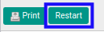
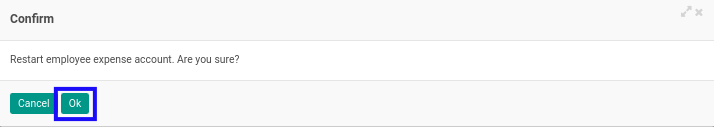

# Merestart Expense Account

## A. INPUT

* Data *Expense Account* yang akan direstart harus memiliki status **Cancelled**.

* User yang akan merestart harus memiliki akses untuk merestart *Expense Account*.

## B. LANGKAH KERJA

1. Buka menu **Human Resources -> Expense Account -> Expense Accounts**. Abaikan jika sudah berada pada menu yang dimaksud.
2. Buka data *Expense Account* yang akan direstart. Abaikan jika data sudah dibuka.
3. Klik tombol **Restart** pada bagian atas-kiri form.

4. Klik tombol **Ok** pada *pop-up* konfirmasi restart yang muncul.

## C. OUTPUT

* Status dari *Expense Account* akan berubah menjadi **Draft**.

* *Expense Account* dapat kembali dimodifikasi.
