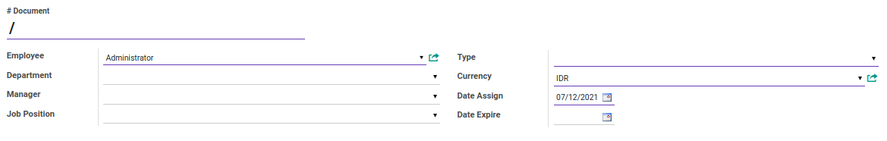
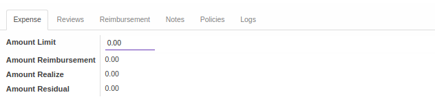
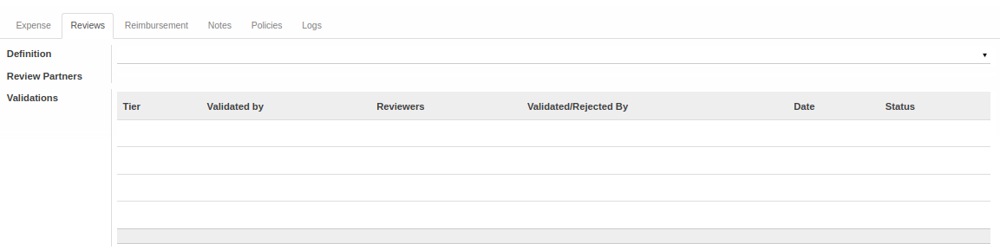
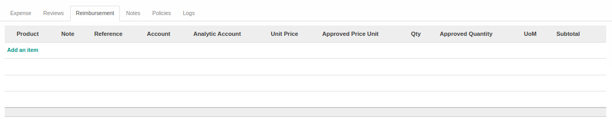
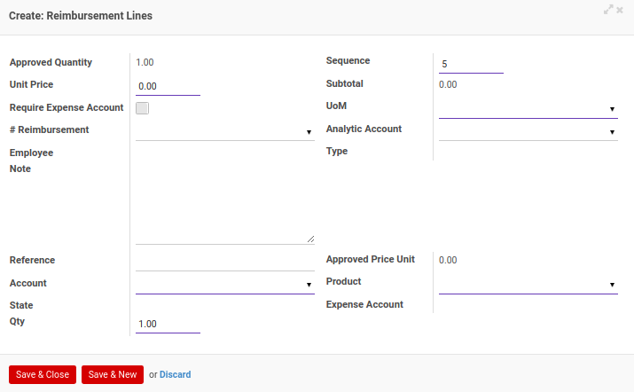
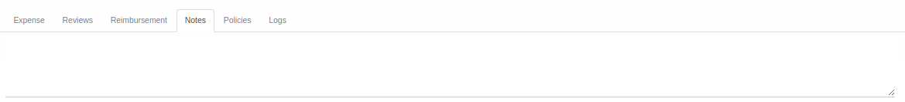
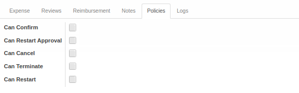
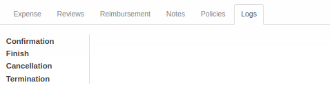

# Penjelasan Expense Account

Informasi pada *Expense Account* dibagi menjadi beberapa bagian, yaitu:

* [Header](#bagian-header)
* [Tab Expense](#tab-expense)
* [Tab Reviews](#tab-reviews)
* [Tab Reimbursement](#tab-reimbursement)
* [Tab Notes](#tab-notes)
* [Tab Policies](#tab-policies)
* [Tab Logs](#tab-logs)

### <a name="bagian-header">HEADER</a>

#### <a name="field-no-document"># Document</a>

Nomor dokumen.

#### <a name="field-employee">Employee</a>

Nama karyawan.

#### <a name="field-department">Department</a>

Nama departemen.

#### <a name="field-manager">Manager</a>

Nama manager (atasan).

#### <a name="field-job-position">Job Position</a>

Nama posisi pekerjaan.

#### <a name="field-type">Type</a>

Tipe akun pengeluaran.

#### <a name="field-currency">Currency</a>

Mata uang yang digunakan.

#### <a name="field-date-assign">Date Assign</a>

Tanggal awal penetapan.

#### <a name="field-date-expire">Date Expire</a>

Tanggal akhir berlaku.

#### <a name="tab-expense">TAB EXPENSE</a>

#### <a name="field-amount-limit">Amount Limit</a>

Batas Jumlah.

#### <a name="field-amount-reimbursement">Amount Reimbursement</a>

Jumlah penggantian untuk pengeluaran.

#### <a name="field-amount-realize">Amount Realize</a>

Jumlah realisasi.

#### <a name="field-amount-residual">Amount Residual</a>

Jumlah sisa.

#### <a name="tab-reviews">TAB REVIEWS</a>

#### <a name="field-definition">Definition</a>

Template multiple review yang digunakan.

#### <a name="field-review-partners-validations">Review Partners Validations</a>

Nama-nama user yang dapat menyetujui/menolak *expense account*

#### <a name="tabel-validations">TABEL Validations</a>

Tahapan-tahapan persetujuan *expense account*

#### <a name="field-validations-tier">Tier</a>

Urutan persetujuan

#### <a name="field-validations-validated-by">Validated By</a>

Metode pemilihan user-user yang dapat menyetujui/menolak *expense account*. Metode pemilihan terdiri dari 3 (tiga) yaitu:

1. *Specific user*. User-user yang dapat menyetujui/menolak *expense account* ditentukan langsung.
2. *Any user in specific group*. User-user yang dapat menyetujui/menolak *expense account* adalah user-user yang tergabung dalam kelompok-kelompok user yang ditentukan.
3. *Both specific user and group*. User-user yang dapat menyetujui/menolak *expense account* ditentukan langsung ditambah dengan user-user yang tergabung dalam kelompok-kelompok user yang ditentukan.
4. *Python code*. User-user yang dapat menyetujui/menolak *expense account* ditentukan oleh algoritma kode python tertentu

#### <a name="field-validations-reviewers">Reviewers</a>

Nama-nama user yang dapat menyetujui/menolak *expense account* pada *tier* yang dimaksud.

#### <a name="field-validations-validated-rejected">Validated/Rejected By</a>

User yang menyetujui/menolak *expense account*.

#### <a name="field-validations-date">Date</a>

Tanggal dan waktu **Validated/Rejected By** menyetujui/menolak *expense account*

#### <a name="field-validations-date">Status</a>

Status persetujuan, terdiri dari 2 (dua) kemungkinan:

1. **Approved**. Tier disetujui.
2. **Rejected**. Tier ditolak.

#### <a name="tab-reimbursement">TAB REIMBURSEMENT</a>

*Pop Up Reimbursement* saat *add an item* diklik.

#### <a name="field-approved-quantity">Approved Quantity</a>

Jumlah yang disetujui.

#### <a name="field-unit-price">Unit Price</a>

Harga satuan.

#### <a name="field-require-expense-account">Require Expense Account</a>

Penanda dibutuhkan akun pengeluaran.

#### <a name="field-no-reimbursement"># Reimbursement</a>

Nomor reimbursement.

#### <a name="field-employee-note">Employee Note</a>

Catatan karyawan.

#### <a name="field-reimbursement-sequence">Sequence</a>

Nomor Urut.

#### <a name="field-subtotal">Subtotal</a>

Jumlah subtotal.

#### <a name="field-uom">UOM</a>

Unit satuan yang digunakan.

#### <a name="field-analytic-account">Analytic Account</a>

Akun analitik yang digunakan.

#### <a name="field-type">Type</a>

Tipe akun pengeluaran.

#### <a name="field-reference">Reference</a>

Referensi.

#### <a name="field-account">Account</a>

Nama akun yang digunakan.

#### <a name="field-state">State</a>

Status.

#### <a name="field-qty">Qty</a>

Jumlah.

#### <a name="field-approved-price-unit">Approved Price Unit</a>

Satuan harga yang disetujui.

#### <a name="field-product">Product</a>

Nama produk.

#### <a name="field-expense-account">Expense Account</a>

Nama akun pengeluaran.

#### <a name="tab-notes">TAB NOTES</a>

#### <a name="field-notes">Notes</a>

Catatan.

#### <a name="tab-policies">TAB POLICIES</a>

#### <a name="field-confirm">Can Confirm</a>

Berhak/tidaknya user aktif untuk dapat mengkonfirmasi expense account.

#### <a name="field-restart-approval">Can Restart Approval</a>

Berhak/tidaknya user aktif untuk dapat merestart persetujuan expense account.

#### <a name="field-cancel">Can Cancel</a>

Berhak/tidaknya user aktif untuk dapat membatalkan expense account.

#### <a name="field-terminate">Can Terminate</a>

Berhak/tidaknya user aktif untuk dapat mengakhiri expense account.

#### <a name="field-restart">Can Restart</a>

Berhak/tidaknya user aktif untuk dapat merestart expense account.

#### <a name="tab-logs">TAB LOGS</a>

#### <a name="field-confirmation">Confirmation</a>

Waktu konfirmasi dan user yang mengkonfirmasi expense account.

#### <a name="field-finish">Finish</a>

Waktu selesai dan user yang menyelesaikan expense account.

#### <a name="field-cancellation">Cancellation</a>

Waktu batal dan user yang membatalkan expense account.

#### <a name="field-termination">Termination</a>

Waktu akhir dan user yang mengakhiri expense account.
