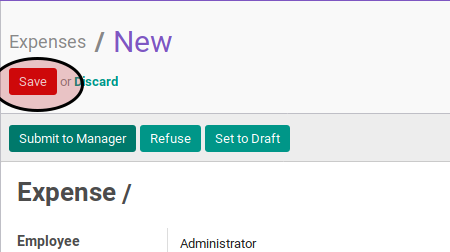

# Membuat Expense

1. Buka menu **Human Resource -> Expense -> Expense**
2. Klik tombol **Create** pada bagian atas-kiri form

3. Pilih **[Employee](./penjelasan.md#field-employee)**. Harus diisi.
4. Isi **[Date](./penjelasan.md#field-date)**. Harus diisi.
5. Jangan ubah isian **[Department](./penjelasan.md#field-department)**.
6. Jangan ubah isian **[Company](./penjelasan.md#field-company)**.
7. Isi **[Description](./penjelasan.md#field-description)**. Harus diisi.
8. Pilih **[Currency](./penjelasan.md#field-currency)**. Harus diisi.
9. Untuk setiap item reimbusement, [input detail](./membuat-detail.md).
10. Klik tombol **Save** pada bagian atas-kiri form.

