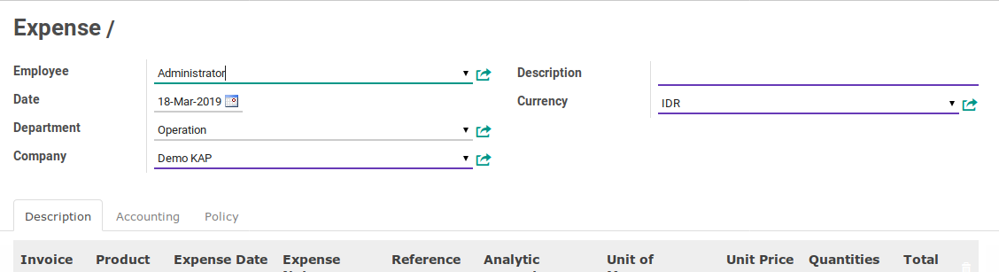
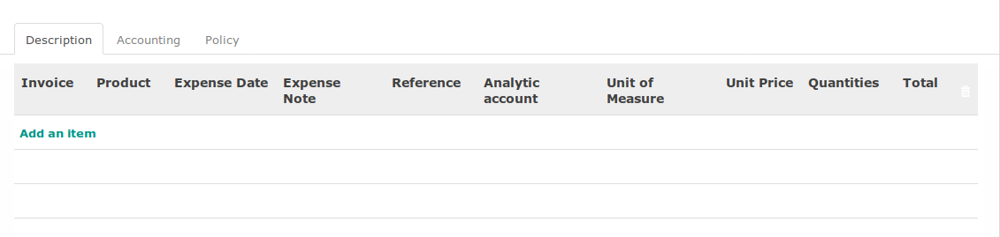
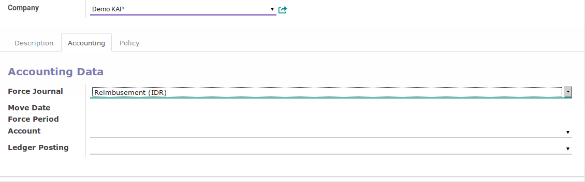

# Penjelasan

#### <a name="field-employee">Employee</a>

Karyawan yang mengajukan reimbusement

#### <a name="field-date">Date</a>

Tanggal pengajuan reimbusement

#### <a name="field-department">Department</a>

Unit kerja karyawan yang mengajukan reimbusement

#### <a name="field-company">Company</a>

Perusahaan pemilik data reimbusement

#### <a name="field-description">Description</a>

Keterangan utama mengenai reimbusement

#### <a name="field-currency">Currency</a>

Mata uang reimbusement

#### <a name="field-invoice">Invoice</a>

Supplier invoice yang dibayarkan oleh karyawan

#### <a name="field-product">Product</a>

Item reimbusement

#### <a name="field-expense-date">Expense Date</a>

Tanggal terjadinya item reimbusement

#### <a name="field-reference">Reference</a>

Dokumen pendukung terjadinya item reimbusement

#### <a name="field-analytic-account">Analytic Account</a>

Kode biaya

#### <a name="field-uom">Unit of Measure</a>

Satuan item reimbusement

#### <a name="field-price">Unit Prices</a>

Harga satuan item reimbusement

#### <a name="field-qty">Quantities</a>

Jumlah item reimbusement

#### <a name="field-total">Total</a>

Unit Price x Quantities

#### <a name="field-journal">Force Journal</a>

Buku jurnal yang akan digunakan untuk mencatat penjurnal reimbusement

#### <a name="field-move-date">Move Date</a>

#TODO

#### <a name="field-period">Force Period</a>

#TODO

#### <a name="field-account">Account</a>

#TODO

#### <a name="field-ledger">Ledger Posting</a>

#TODO
