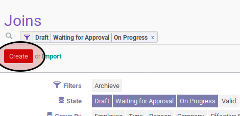

# Membuat Join Transition

## A. INPUT

*(Tidak ada prasyarat khusus)*

## B. INSTRUKSI KERJA

1. Buka menu **Human Resources -> Career Transition -> Joins**. Abaikan jika sudah berada pada menu yang dimaksud.
2. Klik tombol **Create** pada bagian atas-kiri form.

3. Isi dan sesuaikan **# Document** jika dibutuhkan. Harus diisi.
4. Pilih **Company**.
5. Isi **Effective Date**.
6. Pilih **Reason**.
7. Aktifkan **Archieve** jika dibutuhkan.
8. Pilih **Employee**.
9. Pilih **Contract Type**.
10. Isi **Contract Duration Start**.
11. Isi **Contract Duration End**.
12. Buka tab **Career Transition Detail**.
13. Pilih **Company**.
14. Pilih **Department**.
15. Pilih **Job**.
16. Pilih **Job Grade**.
17. Pilih **Working Schedule**.
18. Pilih **Salary Structure**.
19. Tambah/Modifikasi/Hapus **Input Types**.
20. Pilih **Analytic Account**.
21. Tambah/Modifikasi/Hapus **Timesheet Computations**.
22. Klik tombol **Save** pada bagian atas-kiri form.

## C. OUTPUT

* Data join transition akan terbuat dengan status **Draft**.

