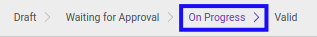

# Memvalidasi Join Transition

## A. INPUT

* Data join transition yang akan divalidasi harus memiliki status **On Progress**.

* User yang akan memvalidasi harus memiliki akses untuk memvalidasi join transition.

## B. INSTRUKSI KERJA

1. Buka menu **Human Resources -> Career Transition -> Joins**. Abaikan jika sudah berada pada menu yang dimaksud.
2. Buka data join transition yang akan divalidasi. Abaikan jika data sudah dibuka.
3. Klik tombol **Valid** pada bagian atas-kiri form.

## C. OUTPUT

* Data join transition akan berubah menjadi **Valid**.

