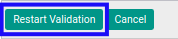
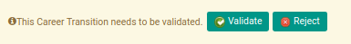

# Merestart Persetujuan Join Transition

## A. INPUT

* Data *join transition* yang dapat direstart persetujuan harus memiliki status **Waiting for Approval**.

* User yang akan merestart persetujuan harus memiliki akses untuk merestart persetujuan *join transition*.

## B. LANGKAH KERJA

1. Buka menu **Human Resources -> Career Transition -> Joins**. Abaikan jika sudah berada pada menu yang dimaksud.
2. Buka data *join transition* yang akan direstart persetujuan. Abaikan jika data sudah dibuka.
3. Klik tombol **Restart Validation** pada bagian atas-kiri form.

## C. OUTPUT

* User dapat kembali menyetujui/menolak data *join transition*.

