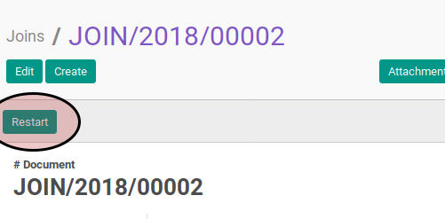

# Merestart Join Transition

## A. INPUT

* Data join transition yang akan direstart harus memiliki status **Cancel**.

* User yang akan merestart harus memiliki akses untuk merestart join transition.

## B. INSTRUKSI KERJA

1. Buka menu **Human Resources -> Career Transition -> Joins**. Abaikan jika sudah berada pada menu yang dimaksud.
2. Buka data join transition yang akan direstart. Abaikan jika data sudah dibuka.
3. Klik tombol **Restart** pada bagian atas-kiri form.

## C. OUTPUT

* Data join transition akan berubah menjadi **Draft**.

