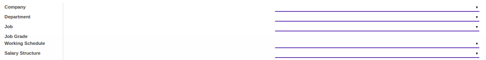

# Penjelasan Join Transition

Informasi pada Join Transition dibagi menjadi beberapa area, diantaranya:
* [Header](#bagian-header)
* [Tab Career Transition Detail](#tab-career)
* [Tab Note](#tab-note)
* [Tab Policy](#tab-policy)
* [Tab Log](#tab-log)

### <a name="bagian-header">HEADER</a>

#### <a name="field-document"># Document</a>

Nomor dokumen join trasisi

#### <a name="field-id">ID</a>

Nomor ID join transisi

#### <a name="field-employee">Employee</a>

Mendefinisikan karyawan

#### <a name="field-company">Company</a>

Mendefinisikan perusahaan tempat karyawan bekerja

#### <a name="field-previous-contract">Need Previous Contract</a>

Jika dicentang, maka proses join transisi membutuhkan kontrak sebelumnya

#### <a name="field-effective-date">Effective Date</a>

Mendefinisikan tanggal efektif join transisi

#### <a name="field-previous-contract">Previous Contract</a>

Mendefinisikan kontrak sebelumnya

#### <a name="field-reason">Reason</a>

Mendefinisikan alasan join transisi

#### <a name="field-create-new-contract">Create New Contract</a>

Jika dicentang, maka akan dibuatkan kontrak baru

#### <a name="field-archieve">Archieve</a>

#TODO

#### <a name="field-new-contract">New Contract</a>

Mendefinisikan kontrak baru yang baru dibuat

#### <a name="field-contract-type">Contract Type</a>

Mendefinisikan tipe kontrak

#### <a name="field-contract-duration">Contract Duration</a>

Mendefinisikan tanggal mulai dan berakhirnya kontrak

### <a name="bagian-header">TAB CAREER TRANSITION DETAIL</a>

#### <a name="field-transisi-company">Company</a>

Mendefinisikan transisi perusahaan tempat karyawan bekerja

#### <a name="field-transisi-department">Department</a>

Mendefinisikan transisi department tempat karyawan bekerja

#### <a name="field-transisi-job">Job</a>

Mendefinisikan transisi pekerjaan

#### <a name="field-transisi-job-grade">Job Grade</a>

Mendefinisikan transisi tingkat pekerjaan

#### <a name="field-transisi-working-schedule">Working Schedule</a>

Mendefinisikan transisi jadwal kerja

#### <a name="field-transisi-salary-structure">Salary Structure</a>

Mendefinisikan transisi *Salary Structure*

#### <a name="field-note">Note</a>

Catatan tambahan terkait join transisi

#### <a name="field-transisi-input-type">Input Type</a>

#TODO

#### <a name="field-transisi-input-type-amount">Amount</a>

Jumlah input type

#### <a name="field-transisi-analytic-account">Analytic Account</a>

Mendefinisikan akun analitik yang digunakan

#### <a name="field-transisi-computation-item">Computation Item</a>

Mendefinisikan komputasi timesheet yang akan digunakan

### <a name="bagian-header">TAB NOTE</a>

#### <a name="field-note">Note</a>

Catatan tambahan terkait join transisi

### <a name="bagian-header">TAB POLICY</a>

#### <a name="field-change-company">Change Company?</a>

Jika dicentang, maka isian *Company* dapat diganti

#### <a name="field-change-department">Change Department</a>

Jika dicentang, maka isian *Department* dapat diganti

#### <a name="field-change-job-title">Change Job Title</a>

Jika dicentang, maka isian *Job Title* dapat diganti

#### <a name="field-change-working-schedule">Change Working Schedule</a>

Jika dicentang, maka isian *Working Schedule* dapat diganti

#### <a name="field-change-job-grade">Change Job Grade?</a>

Jika dicentang, maka isian *Job Grade* dapat diganti

#### <a name="field-change-timesheet-computation">Change Timesheet Computation?</a>

Jika dicentang, maka isian *Timesheet Computation* dapat diganti

#### <a name="field-change-salary-structure">Change Salary Structure?</a>

Jika dicentang, maka isian *Salary Structure* dapat diganti

#### <a name="field-change-analytic-account">Change Analytic Account?</a>

Jika dicentang, maka isian *Analytic Account* dapat diganti

#### <a name="field-change-payslip-input">Change Payslip Input?</a>

Jika dicentang, maka isian *Payslip Input* dapat diganti

#### <a name="field-change-can-confirm">Can Confirm</a>

Jika dicentang, maka user dapat melakukan proses konfirmasi

#### <a name="field-change-can-open">Can Open</a>

Jika dicentang, maka user dapat melakukan proses *Open*

#### <a name="field-change-can-validate">Can Validate</a>

Jika dicentang, maka user dapat melakukan proses validasi

#### <a name="field-change-can-cancel">Can Cancel</a>

Jika dicentang, maka user dapat melakukan proses pembatalan

#### <a name="field-change-can-restart">Can Restart</a>

Jika dicentang, maka user dapat melakukan proses *Restart*

### <a name="bagian-header">TAB LOG</a>

#### <a name="field-log-confirmation">Confirmation</a>

Menginformasikan tanggal konfirmasi terkait join transisi

#### <a name="field-log-validation">Validation</a>

Menginformasikan tanggal validasi terkait join transisi

#### <a name="field-log-cancellation">Cancellation</a>

Menginformasikan tanggal pembatalan terkait join transisi
