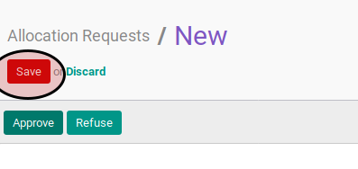

# Membuat Leave Allocation

## A. INPUT

*(Tidak ada prasyarat khusus)*

## B. INSTRUKSI KERJA

1. Buka menu **Human Resources -> Leaves -> Allocation Request**. Abaikan jika sudah berada pada menu yang dimaksud.
2. Klik tombol **Create** pada bagian atas-kiri form.

3. Isi **Description**. Harus diisi.
4. Pilih **Leave Type**. Harus diisi.
5. Isi **Duration**. Harus diisi.
6. Pilih **Employee**. Harus diisi.
7. Klik tombol **Save** pada bagian atas-kiri form.

## C. OUTPUT

* Data leave allocation akan terbuat dengan status **To Approve**.

