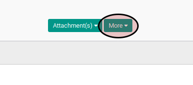
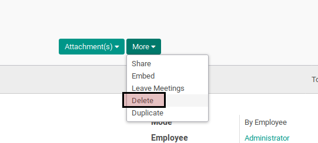

# Menghapus Leave Allocation

## A. INPUT

* Data leave allocation yang akan dimodifikasi harus memiliki status **To Submit** atau **To Approve**

## B. INSTRUKSI KERJA

1. Buka menu **Human Resources -> Leaves -> Allocation Request**. Abaikan jika sudah berada pada menu yang dimaksud.
2. Buka data leave allocation yang akan dihapus. Abaikan jika data sudah dibuka.
3. Klik tombol **More** pada bagian atas-tengah form.

4. Klik tombol **Delete** pada drop-down yang muncul dari tombol **More**.

5. Klik tombol **Ok** pada konfirmasi penghapusan yang muncul

## C. OUTPUT

* Data leave allocation akan terhapus
