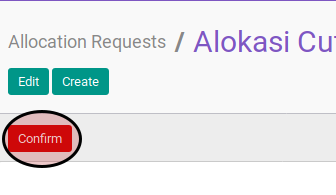

# Mengkonfirmasi Leave Allocation

## A. INPUT

* Data leave allocation yang akan dikonfirmasi harus memiliki status **To Approve**

* User yang akan mengkonfirmasi harus memiliki akses untuk mengkonfirmasi leave allocation.

## B. INSTRUKSI KERJA

1. Buka menu **Human Resources -> Leaves -> Allocation Request**. Abaikan jika sudah berada pada menu yang dimaksud.
2. Buka data leave allocation yang akan dikonfirmasi. Abaikan jika data sudah dibuka.
3. Klik tombol **Confirm** pada bagian atas-kiri form.

## C. OUTPUT

* Data leave allocation akan berubah menjadi **To Approve**.

