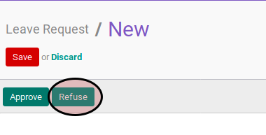

# Menolak Leave

## A. INPUT

* Data leave yang akan ditolak harus memiliki status **To Approve** atau **Approved**

* User yang akan menolak harus memiliki akses untuk menolak leave.

## B. INSTRUKSI KERJA

1. Buka menu **Human Resources -> Leaves -> Leave Request**. Abaikan jika sudah berada pada menu yang dimaksud.
2. Buka data leave yang akan ditolak. Abaikan jika data sudah dibuka.
3. Klik tombol **Refuse** pada bagian atas-kiri form.

## C. OUTPUT

* Data leave akan berubah menjadi **Refused**.

