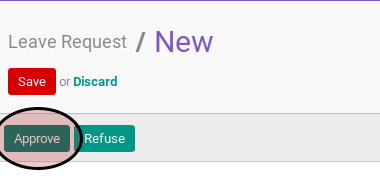

# Menyetujui Leave

## A. INPUT

* Data leave yang akan disetujui harus memiliki status **To Approve**

* User yang akan menyetujui harus memiliki akses untuk menyetujui leave.

## B. INSTRUKSI KERJA

1. Buka menu **Human Resources -> Leaves -> Leave Request**. Abaikan jika sudah berada pada menu yang dimaksud.
2. Buka data leave yang akan disetujui. Abaikan jika data sudah dibuka.
3. Klik tombol **Approve** pada bagian atas-kiri form.

## C. OUTPUT

* Data leave akan berubah menjadi **Approved**.

