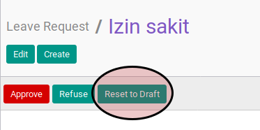

# Merestart Leave

* Data leave yang akan direstart harus memiliki status **To Approve**

* User yang akan merestart harus memiliki akses untuk merestart leave.

## B. INSTRUKSI KERJA

1. Buka menu **Human Resources -> Leaves -> Leave Request**. Abaikan jika sudah berada pada menu yang dimaksud.
2. Buka data leave yang akan direstart. Abaikan jika data sudah dibuka.
3. Klik tombol **Set To Draft** pada bagian atas-kiri form.

## C. OUTPUT

* Data leave akan berubah menjadi **To Submit**.

