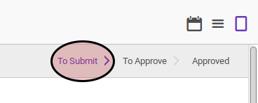
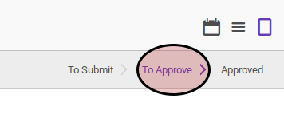

# Memodifikasi Leave

## A. INPUT

* Data leave yang akan dimodifikasi harus memiliki status **To Submit** atau **To Approve**

## B. INSTRUKSI KERJA

1. Buka menu **Human Resources -> Leaves -> Leave Request**. Abaikan jika sudah berada pada menu yang dimaksud.
2. Buka data leave yang akan dimodifikasi. Abaikan jika dataa sudah dibuka.
3. Klik tombol **Edit** pada bagian atas-kiri form.

4. Isi dan sesuaikan **[Description](./penjelasan.md#field-description)** jika dibutuhkan. Harus diisi.
5. Pilih dan sesuaikan **[Leave Type](./penjelasan.md#field-leave-type)** jika dibutuhkan. Harus diisi.
6. Isi dan sesuaikan **[Start Date](./penjelasan.md#field-start-date)** jika dibutuhkan. Harus diisi.
7. Isi dan sesuaikan **[End Date](./penjelasan.md#field-end-date)** jika dibutuhkan. Harus diisi.
8. Pilih dan sesuaikan **[Employee](./penjelasan.md#field-employee)** jika dibutuhkan. Harus diisi.
9. Klik tombol **Save** pada bagian atas-kiri form.

## C. OUTPUT

* Data leave akan berubah sesuai dengan perubahan yang dilakukan
