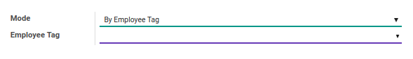

# Penjelasan Leave

### <a name="bagian-header">HEADER</a>

#### <a name="field-description">Description</a>

Mendefenisikan deskripsi terkait permintaan cuti

#### <a name="field-leave-type">Leave Type</a>

Mendefenisikan tipe cuti

#### <a name="field-day-limit-per-request">Day Limit Per Request</a>

Menginformasikan batasan jumlah hari yang diperbolehkan untuk permintaan cuti

#### <a name="field-duration">Duration</a>

* <a name="field-start-date">**1. Start Date:** Mendefinisikan tanggal dan waktu dimulainya cuti</a>
* <a name="field-end-date">**2. End Date:** Mendefinisikan tanggal dan waktu berakhirnya cuti</a>
* **3. Total Days:** Total jumlah hari cuti. Isian ini akan diisi secara otomatis berdasarkan **Start Date** dan **End Date**

#### <a name="field-mode">Mode</a>

Mendefinisikan mode permintaan cuti. Isian ini dibagi atas 2 pilihan, yaitu: 
* **By Employee:** Cuti hanya dapat dilakukan untuk satu karyawan saja

    * <a name="field-employee">**Employee:** Mendefinisikan karyawan yang akan mengambil cuti</a>
    * **Department:** Mendefinisikan departmen tempat karyawan bekerja. Isian ini diisi otomatis oleh odoo berdasarkan **Employee**

* **By Employee Tag:** Cuti dapat dilakukan untuk group karyawan berdasarkan tag

    * **Employee Tag:** Mendefinisikan tag karyawan yang akan mengambil cuti