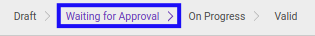
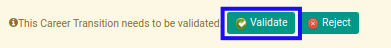
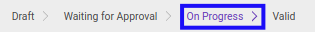

# Menyetujui Mutation Transition

## A. INPUT

* Data *mutation transition* yang akan disetujui harus memiliki status **Waiting for Approval**.

* User yang akan menyetujui harus memiliki akses untuk menyetujui *mutation transition*.

## B. INSTRUKSI KERJA

1. Buka menu **Human Resources -> Career Transition -> Mutations**. Abaikan jika sudah berada pada menu yang dimaksud.
2. Buka data *mutation transition* yang akan disetujui. Abaikan jika data sudah dibuka.
3. Klik tombol **Validate** pada bagian atas-kiri form.

## C. OUTPUT

* Data *mutation transition* akan berubah menjadi **On Progress**.

