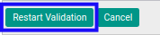
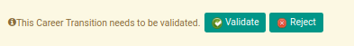

# Merestart Persetujuan Mutation Transition

## A. INPUT

* Data *mutation transition* yang dapat direstart persetujuan harus memiliki status **Waiting for Approval**.

* User yang akan merestart persetujuan harus memiliki akses untuk merestart persetujuan *mutation transition*.

## B. LANGKAH KERJA

1. Buka menu **Human Resources -> Career Transition -> Mutations**. Abaikan jika sudah berada pada menu yang dimaksud.
2. Buka data *mutation transition* yang akan direstart persetujuan. Abaikan jika data sudah dibuka.
3. Klik tombol **Restart Validation** pada bagian atas-kiri form.

## C. OUTPUT

* User dapat kembali menyetujui/menolak data *mutation transition*.

