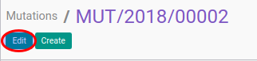
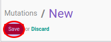

# Memodifikasi Mutation Transition

## A. INPUT

* Data mutation transition yang akan dimodifikasi harus memiliki status **Draft**.

## B. INSTRUKSI KERJA

1. Buka menu **Human Resources -> Career Transition -> Mutations**. Abaikan jika sudah berada pada menu yang dimaksud.
2. Buka data mutation transition yang akan dimodifikasi. Abaikan jika data sudah dibuka.
3. Klik tombol **Edit** pada bagian atas-kiri form.

4. Isi dan sesuaikan **[# Document](./penjelasan.md#field-document)** jika dibutuhkan. Harus diisi.
5. Pilih dan sesuaikan **[Company](./penjelasan.md#field-company)** jika dibutuhkan. Harus diisi.
6. Isi dan sesuaikan **[Effective Date](./penjelasan.md#field-effective-date)** jika dibutuhkan. Harus diisi.
7. Pilih dan sesuaikan **[Reason](./penjelasan.md#field-reason)** jika dibutuhkan. Tidak harus diisi.
8. Aktifkan **[Archieve](./penjelasan.md#field-archieve)** jika dibutuhkan.
9. Pilih dan sesuaikan **[Employee](./penjelasan.md#field-employee)** jika dibutuhkan. Harus diisi.
10. Pilih dan sesuaikan **[Contract Type](./penjelasan.md#field-contract-type)** jika dibutuhkan. Harus diisi.
11. Isi dan sesuaikan **[Contract Duration Start](./penjelasan.md#field-contract-duration)** jika dibutuhkan. Harus diisi.
12. Isi dan sesuaikan **[Contract Duration End](./penjelasan.md#field-document)** jika dibutuhkan. Harus diisi.
13. Buka tab [**Career Transition Detail**](./penjelasan.md#tab-career).
14. Pilih dan sesuaikan **[Company](./penjelasan.md#field-transisi-company)** jika dibutuhkan. Harus diisi.
15. Pilih dan sesuaikan **[Department](./penjelasan.md#field-transisi-departement)** jika dibutuhkan. Harus diisi.
16. Pilih dan sesuaikan **[Job](./penjelasan.md#field-transisi-job)** jika dibutuhkan. Harus diisi.
17. Pilih dan sesuaikan **[Job Grade](./penjelasan.md#field-transisi-job-grade)** jika dibutuhkan. Harus diisi.
18. Pilih dan sesuaikan **[Working Schedule](./penjelasan.md#field-transisi-working-schedule)** jika dibutuhkan. Harus diisi.
19. Pilih dan sesuaikan **[Salary Structure](./penjelasan.md#field-transisi-salary-structure)** jika dibutuhkan. Harus diisi.
20. <a name="l20">[Tambah](./menambahkan-payslip-input.md)/[Modifikasi](./modifikasi-payslip-input.md)/[Hapus](./menghapus-payslip-input.md)</a> [**Input Types**](./penjelasan.md#tabel-input-types).
21. <a name="l21">Pilih dan sesuaikan **[Analytic Account](./penjelasan.md#field-transisi-analytic-account)** jika dibutuhkan. Harus diisi.</a>
22. <a name="l22">[Tambah](./menambahkan-timesheet-computation.md)/[Modifikasi](./modifikasi-timesheet-computation.md)/[Hapus](./menghapus-timesheet-computation.md)</a> [**Timesheet Computations**](./penjelasan.md#tabel-timesheet-computation).
23. <a name="l23">Klik tombol **Save** pada bagian atas-kiri form.</a>

## C. OUTPUT

* Data mutation transition akan berubah sesuai dengan perubahan yang dilakukan
