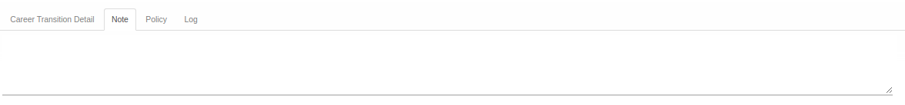

# Penjelasan Mutation Transition

Informasi pada Mutation Transition dibagi menjadi beberapa area, diantaranya:
* [Header](#bagian-header)
* [Tab Career Transition Detail](#tab-career)
* [Tab Note](#tab-note)
* [Tab Policy](#tab-policy)
* [Tab Log](#tab-log)

### <a name="bagian-header">HEADER</a>

#### <a name="field-document"># Document</a>

Nomor dokumen.

#### <a name="field-id">ID</a>

ID database.

#### <a name="field-employee">Employee</a>

Karyawan yang mengalami transisi.

#### <a name="field-company">Company</a>

Perusahaan pemilik dokumen transisi.

#### <a name="field-previous-contract">Need Previous Contract</a>

Diisi otomatis oleh Odoo. Jika aktif maka karyawan yang mengalami transisi harus memiliki [kontrak](../employee-contract.md).

#### <a name="field-effective-date">Effective Date</a>

Tanggal transisi akan berlaku.

#### <a name="field-previous-contract">Previous Contract</a>

Diisi otomatiss oleh Odoo. Nomor kontrak karyawan sebelum transisi ini berlaku.

#### <a name="field-reason">Reason</a>

Alasan transisi.

#### <a name="field-create-new-contract">Create New Contract</a>

Diisi otomatis oleh Odoo. Apabila aktif, Odoo akan membuat kontrak karyawan baru setelah transisi valid.

#### <a name="field-archieve">Archieve</a>

Aktifkan apabila transisi yang diinput merupakan histori/arsip.

#### <a name="field-new-contract">New Contract</a>

Kontrak karyawan yang secara otomatis dibuat oleh Odoo setelah transisi valid.

#### <a name="field-contract-type">Contract Type</a>

Tipe kontrak (Contoh: PKWT, PKWTT).

#### <a name="field-contract-duration">Contract Duration</a>

Mendefinisikan tanggal mulai dan berakhirnya kontrak.

### <a name="tab-career">TAB CAREER TRANSITION DETAIL</a>

#### <a name="field-transisi-company">Company</a>

Perusahaan di mana karyawan bekerja setelah transisi valid.

#### <a name="field-transisi-department">Department</a>

Unit kerja di mana karyawan bekerja setelah transisi valid.

#### <a name="field-transisi-job">Job</a>

Jabatan karyawan setelah transisi valid.

#### <a name="field-transisi-job-grade">Job Grade</a>

Job grade karyawan setelah transisi valid.

#### <a name="field-transisi-working-schedule">Working Schedule</a>

Jadwal kerja karyawan setelah transisi valid.

#### <a name="field-transisi-salary-structure">Salary Structure</a>

Struktur gaji karyawan setelah transisi valid.

#### <a name="tabel-input-types">TABEL INPUT TYPES</a>

Variabel-variabel penggajian yang dimiliki karyawan setelah transisi valid.

#### <a name="field-transisi-input-type">Input Type</a>

Variabel penggajian.

#### <a name="field-transisi-input-type-amount">Amount</a>

Besaran variabel penggajian.

#### <a name="field-transisi-analytic-account">Analytic Account</a>

Cost center karyawan setelah transisi valid.

#### <a name="tabel-timesheet-computation">TABEL TIMESHEET COMPUTATION</a>

Variabel-variabel yang diperhitungkan dari timesheet karyawan.

#### <a name="field-transisi-computation-item">Computation Item</a>

Variabel perhitungan timesheet.

### <a name="tab-note">TAB NOTE</a>

#### <a name="field-note">Note</a>

Catatan tambahan.

### <a name="tab-policy">TAB POLICY</a>

#### <a name="field-change-company">Change Company?</a>

Diisi otomatis oleh Odoo. Jika aktif, maka isian [**Company**](#field-transisi-company) dapat diganti

#### <a name="field-change-department">Change Department</a>

Disii otomatis oleh Odoo. Jika aktif, maka isian [**Department**](#field-transisi-department) dapat diubah.

#### <a name="field-change-job-title">Change Job Title</a>

Diisi otomatis oleh Odoo. Jika aktif, maka isian [**Job Title**](#field-transisi-job) dapat diubah.

#### <a name="field-change-working-schedule">Change Working Schedule</a>

Diisi otomatis oleh Odoo. Jika aktif, maka isian [**Working Schedule**](field-transisi-working-schedule) dapat diubaah.

#### <a name="field-change-job-grade">Change Job Grade?</a>

Diisi otomatis oleh Odoo. Jika aktif, maka isian [**Job Grade**](#field-transisi-job-grade) dapat diubah.

#### <a name="field-change-timesheet-computation">Change Timesheet Computation?</a>

Diisi otomatis oleh Odoo. Jika aktif, maka tabel [**Timesheet Computation**](#tabel-timesheet-computation) dapat ditambah/dimodifikasi/dihapus.

#### <a name="field-change-salary-structure">Change Salary Structure?</a>

Diisi otomatis oleh Odoo. Jika aktif, maka isian [**Salary Structure**](#field-transisi-salary-structure) dapat diubah.

#### <a name="field-change-analytic-account">Change Analytic Account?</a>

Diisi otomatis oleh Odoo. Jika aktif, maka isian [**Analytic Account**](#field-transisi-analytic-account) dapat diubah.

#### <a name="field-change-payslip-input">Change Payslip Input?</a>

Diisi otomatis oleh Odoo. Jika aktif, maka tabel [**Payslip Inputs**](#tabel-input-types) dapat ditambah/dimodifikasi/dihapus.

#### <a name="field-change-can-confirm">Can Confirm</a>

Diisi otomatis oleh Odoo. Jika aktif, maka user yang membuka data transisi dapat melakukan [mengkonfirmasi transisi](./mengkonfirmasi.md).

#### <a name="field-change-can-open">Can Open</a>

Diisi otomatis oleh Odoo. Jika aktif, maka user yang membuka data transisi dapat memulai proses transisi.

#### <a name="field-change-can-validate">Can Validate</a>

Disii otomatis oleh Odoo. Jika aktif, maka user yang membuka data dapat [memvalidasi transisi](./memvalidasi.md).

#### <a name="field-change-can-cancel">Can Cancel</a>

Diisi otomatis oleh Odoo. Jika aktif, maka user yang membuka data dapat [membatalkan transisi](./membatalkan.md).

#### <a name="field-change-can-restart">Can Restart</a>

Diisi otomatis oleh Odoo. Jika aktif, maka user yang membuka data dapat [merestart transisi](./merestart.md).

### <a name="tab-log">TAB LOG</a>

#### <a name="field-log-confirmation">Confirmation</a>

Diisi otomatis oleh Odoo. Tanggal, waktu dan user yang [mengkonfirmasi transisi](./mengkonfirmasi.md).

#### <a name="field-log-validation">Validation</a>

Diisi otomatis oleh Odoo. Tanggal, waktu, dan user yang [memvalidasi transisi](./memvalidasi.md).

#### <a name="field-log-cancellation">Cancellation</a>

Diisi otomatis oleh Odoo. Tanggal, waktu, dan user yang [membatalkan transisi](./membatalkan.md).