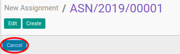

# Membatalkan New Assignment Transition

## A. INPUT

* Data new assignment transition yang akan dibatalkan harus memiliki status selain **Cancel**.

* User yang akan membatalkan harus memiliki akses untuk membatalkan new assignment transition.

## B. INSTRUKSI KERJA

1. Buka menu **Human Resources -> Career Transition -> New Assignments**. Abaikan jika sudah berada pada menu yang dimaksud.
2. Buka data new assignment transition yang akan dibatalkan. Abaikan jika data sudah dibuka.
3. Klik tombol **Cancel** pada bagian atas-kiri form.

## C. OUTPUT

* Data new assignment transition akan berubah menjadi **Cancel**.

